# SCRIPTS BOOTLOADER FOR ASUS ROUTER 使用说明

## 运行环境

华硕路由器官方固件和梅林固件

## 开机自动运行原理

1. 每次路由器启动时，都会自动挂载插入的U盘
2. 通过设置`script_usbmount`参数，可使路由器在成功挂载U盘后，自动执行该参数指向的任何可执行程序（本例中，该程序为`/tmp/mnt/ASUS_ROUTER/script_bootloader/script_bootloader_usb_mount`）
3. 设置被`script_usbmount`参数引用的程序（本例中，该程序为`/tmp/mnt/ASUS_ROUTER/script_bootloader/script_bootloader_usb_mount`），使其先确定路由器已经成功启动，然后调用用户自定义程序列表（本例中，该程序为`/tmp/mnt/ASUS_ROUTER/script_bootloader/bin/list_of_user_custom_scripts`），按顺序逐一执行用户的自定义程序

## 文件结构

`ASUS_ROUTER/`（U盘根目录）

| 权限      | 名称              | 属性 |
| --------- | ----------------- | ---- |
| rwxrwxrwx | script_bootloader | 目录 |

`ASUS_ROUTER/script_bootloader/`（SCRIPTS BOOTLOADER FOR ASUS ROUTER系统根目录）

| 权限      | 名称 | 属性 |
| --------- | ---- | ---- |
| rwxrwxrwx | bin  | 目录 |
| rwxrwxrwx | etc  | 目录 |
| rwxrwxrwx | tmp  | 目录 |
| rwxrwxrwx | usr  | 目录 |
| rwxrwxrwx | var  | 目录 |

`ASUS_ROUTER/script_bootloader/bin/`（SCRIPTS BOOTLOADER FOR ASUS ROUTER系统可执行文件目录）

| 权限      | 名称                           | 属性     | 功能 |
| --------- | ------------------------------ | -------- | --------- |
| rwxrwxrwx | install                      | 普通文件 | 一键安装本系统 |
| rwxrwxrwx | uninstall                    | 普通文件 | 一键卸载本系统 |
| rwxrwxrwx | restore | 普通文件 | 恢复程序。每次路由器更新固件后使用 |
| rwxrwxrwx | label_modifier               | 普通文件 | U盘工具 |
| rwxrwxrwx | list_of_user_custom_scripts | 普通文件 | 内部调用 |
| rwxrwxrwx | script_bootloader_usb_mount  | 普通文件 | 内部调用 |
| rwxrwxrwx | script_bootloader_usb_umount | 普通文件 | 内部调用 |
| rwxrwxrwx | sys_install | 普通文件 | 内部调用 |

`ASUS_ROUTER/script_bootloader/etc/`（SCRIPTS-BOOTLOADER-FOR-ASUS-ROUTER系统配置文件目录）

`ASUS_ROUTER/script_bootloader/tmp/`（SCRIPTS-BOOTLOADER-FOR-ASUS-ROUTER系统临时文件目录）

`ASUS_ROUTER/script_bootloader/var/`（SCRIPTS-BOOTLOADER-FOR-ASUS-ROUTER系统可变文件目录）

`ASUS_ROUTER/script_bootloader/usr/`（SCRIPTS-BOOTLOADER-FOR-ASUS-ROUTER系统外部软件资源目录，即插件目录）

| 权限      | 名称                             | 属性 |
| --------- | -------------------------------- | ---- |
| rwxrwxrwx | development_tools                | 目录 |
| rwxrwxrwx | entware                          | 目录 |
| rwxrwxrwx | monit                            | 目录 |
| rwxrwxrwx | swap                             | 目录 |
| rwxrwxrwx | timezone                         | 目录 |
| rwxrwxrwx | 自定义程序名（本例中为software） | 目录 |

`ASUS_ROUTER/script_bootloader/usr/development_tools/`（插件development_tools目录）

| 权限      | 名称      | 属性     |
| --------- | --------- | -------- |
| rwxrwxrwx | README.md | 普通文件 |
| rwxrwxrwx | bin       | 目录     |
| rwxrwxrwx | etc       | 目录     |

`ASUS_ROUTER/script_bootloader/usr/development_tools/bin/`（插件development_tools可执行文件目录）

| 权限      | 名称                              | 属性     |
| --------- | --------------------------------- | -------- |
| rwxrwxrwx | development_tools_install         | 普通文件 |
| rwxrwxrwx | development_tools_enable.service  | 普通文件 |
| rwxrwxrwx | development_tools_disable.service | 普通文件 |

`ASUS_ROUTER/script_bootloader/usr/development_tools/etc/`（插件development_tools配置文件目录）

| 权限      | 名称                     | 属性     |
| --------- | ------------------------ | -------- |
| rwxrwxrwx | armv7l_list_of_packages  | 普通文件 |
| rwxrwxrwx | aarch64_list_of_packages | 普通文件 |

`ASUS_ROUTER/script_bootloader/usr/entware/`（插件entware目录）

| 权限      | 名称      | 属性     |
| --------- | --------- | -------- |
| rwxrwxrwx | README.md | 普通文件 |
| rwxrwxrwx | bin       | 目录     |

`ASUS_ROUTER/script_bootloader/usr/entware/bin/`（插件entware可执行文件目录）

| 权限      | 名称                    | 属性     |
| --------- | ----------------------- | -------- |
| rwxrwxrwx | entware_install         | 普通文件 |
| rwxrwxrwx | entware_enable.service  | 普通文件 |
| rwxrwxrwx | entware_disable.service | 普通文件 |

`ASUS_ROUTER/script_bootloader/usr/entware/etc/`（插件entware配置文件目录）

`ASUS_ROUTER/script_bootloader/usr/monit/`（插件monit目录）

| 权限      | 名称      | 属性     |
| --------- | --------- | -------- |
| rwxrwxrwx | README.md | 普通文件 |
| rwxrwxrwx | bin       | 目录     |
| rwxrwxrwx | etc       | 目录     |

`ASUS_ROUTER/script_bootloader/usr/monit/bin/`（插件monit可执行文件目录）

| 权限      | 名称                 | 属性     |
| --------- | -------------------- | -------- |
| rwxrwxrwx | monit_install        | 普通文件 |

`ASUS_ROUTER/script_bootloader/usr/monit/etc/`（插件monit可变文件目录）

| 权限      | 名称         | 属性     |
| --------- | ------------ | -------- |
| rwxrwxrwx | mmonitrc | 普通文件     |
| rwxrwxrwx | mmonitrc.bak | 普通文件 |

`ASUS_ROUTER/script_bootloader/usr/swap/`（插件swap目录）

| 权限      | 名称      | 属性     |
| --------- | --------- | -------- |
| rwxrwxrwx | README.md | 普通文件 |
| rwxrwxrwx | bin       | 目录     |
| rwxrwxrwx | var       | 目录     |

`ASUS_ROUTER/script_bootloader/usr/swap/bin/`（插件swap可执行文件目录）

| 权限      | 名称                 | 属性     |
| --------- | -------------------- | -------- |
| rwxrwxrwx | swap_install         | 普通文件 |
| rwxrwxrwx | swap_enable.service  | 普通文件 |
| rwxrwxrwx | swap_disable.service | 普通文件 |

`ASUS_ROUTER/script_bootloader/usr/swap/var/`（插件swap可变文件目录）

| 权限      | 名称         | 属性     |
| --------- | ------------ | -------- |
| rwxrwxrwx | swapfile.var | 普通文件 |

`ASUS_ROUTER/script_bootloader/usr/timezone/`（插件timezone目录）

| 权限      | 名称      | 属性     |
| --------- | --------- | -------- |
| rwxrwxrwx | README.md | 普通文件 |
| rwxrwxrwx | bin       | 目录     |
| rwxrwxrwx | var       | 目录     |

`ASUS_ROUTER/script_bootloader/usr/timezone/bin/`（插件timezone可执行文件目录）

| 权限      | 名称                     | 属性     |
| --------- | ------------------------ | -------- |
| rwxrwxrwx | timezone_install         | 普通文件 |
| rwxrwxrwx | timezone_enable.service  | 普通文件 |
| rwxrwxrwx | timezone_disable.service | 普通文件 |

`ASUS_ROUTER/script_bootloader/usr/timezone/etc/`（插件timezone配置文件目录）

`ASUS_ROUTER/script_bootloader/usr/自定义程序名（本例中为software）/`（自定义程序，即插件的全部文件）

| 权限      | 名称      | 属性      |
| --------- | --------  | --------  |
| rwxrwxrwx | README.md | 普通文件  |
| rwxrwxrwx | bin       | 目录      |
| rwxrwxrwx | etc       | 目录      |
| rwxrwxrwx | tmp       | 目录      |
| rwxrwxrwx | usr       | 目录      |
| rwxrwxrwx | var       | 目录      |

`ASUS_ROUTER/script_bootloader/usr/自定义程序名（本例中为software）/bin/`（此程序可执行文件目录）

| 权限      | 名称                     | 属性     |
| --------- | ------------------------ | -------- |
| rwxrwxrwx | software_enable.service  | 普通文件 |
| rwxrwxrwx | software_disable.service | 普通文件 |

`ASUS_ROUTER/script_bootloader/usr/自定义程序名（本例中为software）/etc/`（此程序配置文件目录）

| 权限      | 名称          | 属性     |
| --------- | ------------- | -------- |
| rwxrwxrwx | software.conf | 普通文件 |

`ASUS_ROUTER/script_bootloader/usr/自定义程序名（本例中为software）/tmp/`（此程序临时文件目录）

| 权限      | 名称         | 属性     |
| --------- | ------------ | -------- |
| rwxrwxrwx | software.tmp | 普通文件 |

`ASUS_ROUTER/script_bootloader/usr/自定义程序名（本例中为software）/usr/`（此程序外部软件资源目录）

| 权限      | 名称     | 属性     |
| --------- | -------- | -------- |
| rwxrwxrwx | software | 普通文件 |

`ASUS_ROUTER/script_bootloader/usr/自定义程序名（本例中为software）/var/`（此程序可变文件目录）

| 权限      | 名称         | 属性     |
| --------- | ------------ | -------- |
| rwxrwxrwx | software.var | 普通文件 |

## 使用说明

#### 安装前准备

1. 准备一个空白U盘

   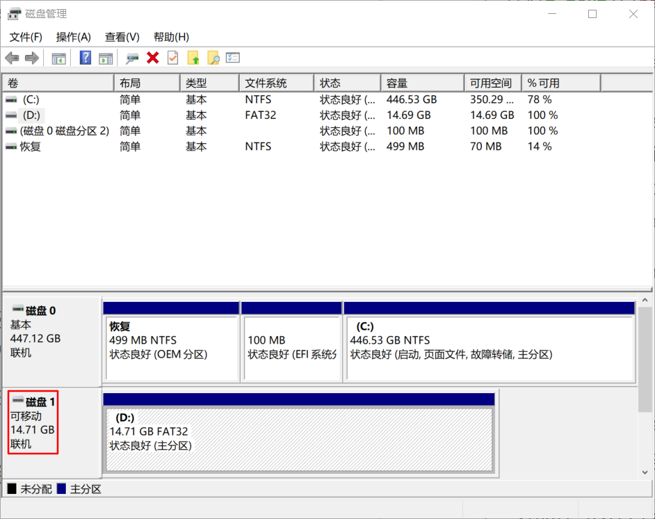

2. 删除U盘上的全部分区

   

   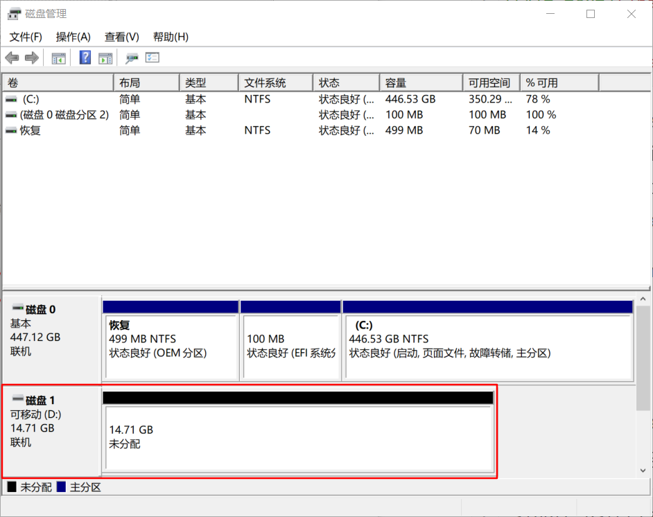

3. 弹出U盘，将其插入路由器的USB2.0插口（确保路由器**唯一**插入了此U盘）

   

4. 用ssh登陆路由器后台

   

5. 执行`df`，查看磁盘挂载情况。很明显，由于该U盘没有分区，所以路由器没有挂载

   

6. 对U盘分区
   - 执行`fdisk /dev/sda`

     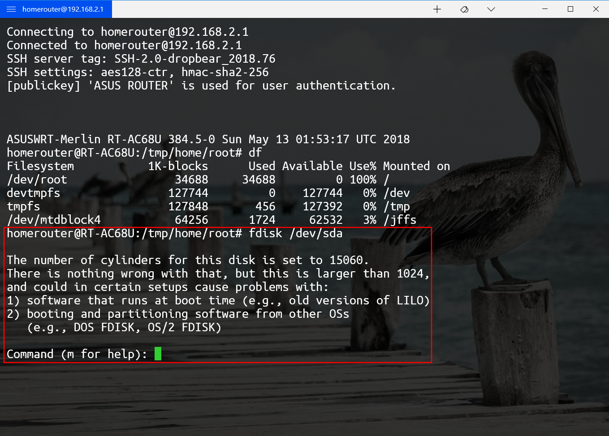

   - 输入`p`，查看分区表。很明显，由于该U盘没有分区

     

   - 输入`n`，创建新分区

     

   - 输入`p`，设置新分区类型为主分区

     

   - 输入`1`，设置主分区编号为1

     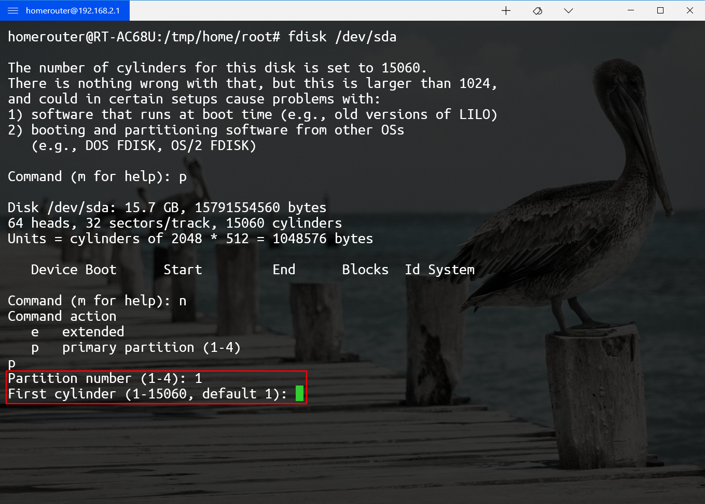

   - 什么都不输，直接按回车，默认设置第一柱面为1

     

   - 什么都不输，直接按回车，默认设置最后柱面为最大值（取决于U盘容量）

     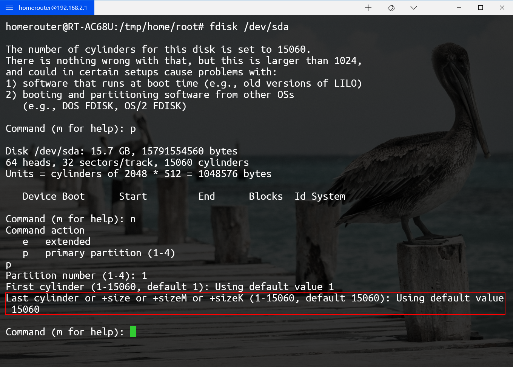

   - 输入`w`，将分区表写入U盘

     

7. 执行`umount /dev/sda1`卸载U盘

   > 注意：
   >
   > 部分路由器固件会提示
   >
   > ```
   > umount: can't unmount /dev/sda1: Invalid argument
   > ```
   > 
   > 这不会影响后续步骤，无需理会

   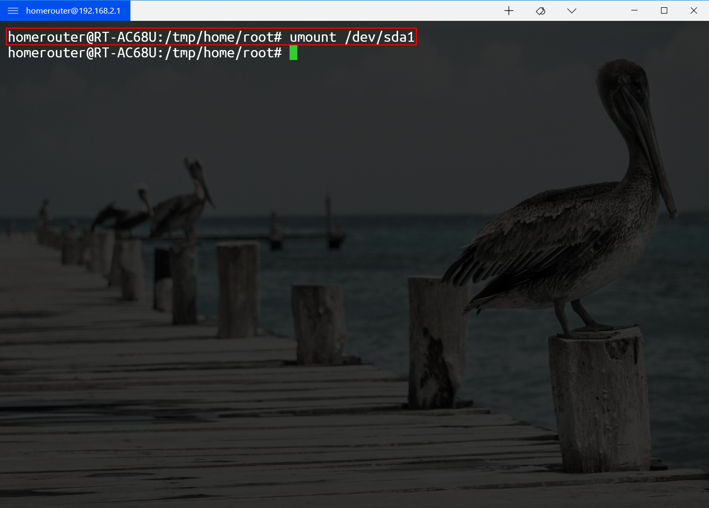

8. 格式化U盘分区

   - 执行`mkfs.ext3 -L ASUS_ROUTER /dev/sda1`

     

   - 输入`y`，等待格式化完成
     
     > 注意：
     > 
     > 部分路由器固件会直接执行格式化，无需输入`y`
     
     

9. 格式化完成之后，执行`reboot`，重启路由器

   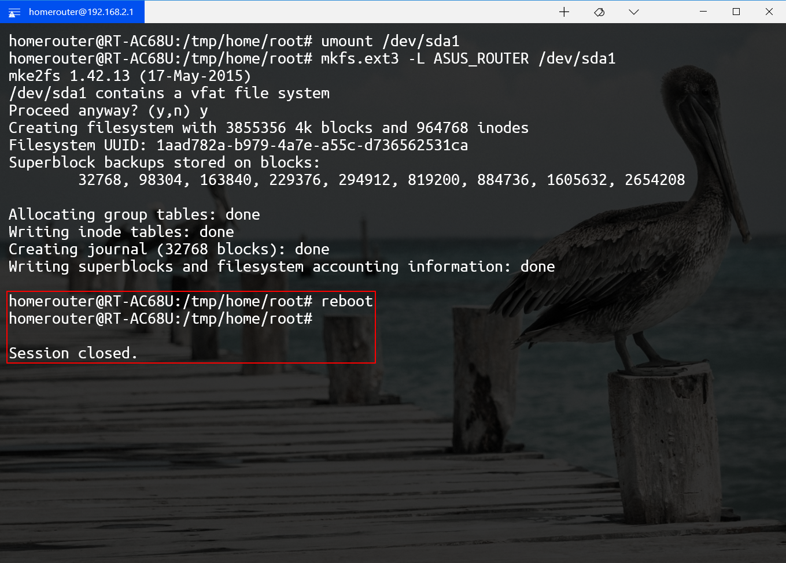

10. 路由器重启后，用ssh登陆路由器后台，执行`cd /tmp/mnt/ASUS_ROUTER/`，进入该目录

    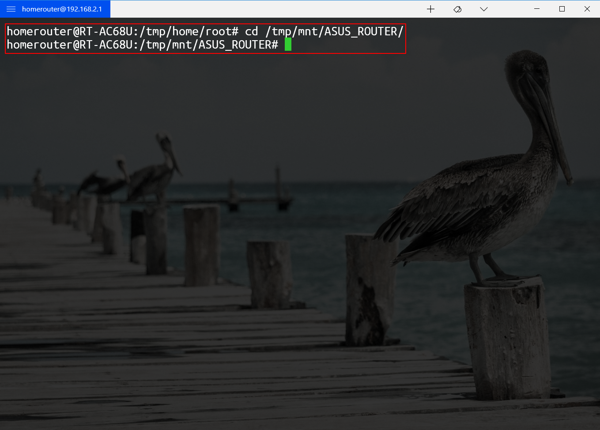

11. 执行`wget --no-cookie --no-check-certificate https://github.com/JACK-THINK/SCRIPTS-BOOTLOADER-FOR-ASUS-ROUTER/archive/N.N.tar.gz`，下载安装包（`N.N`是版本号，请自己替换成所下载的版本号）

    > 注意：
    >
    > 部分路由器固件会提示
    >
    > ```
    > OpenSSL: error:1409442E:SSL routines:ssl3_read_bytes:tlsv1 alert protocol version
    > Unable to establish SSL connection.
    > ```
    >
    > 无法完成下载
    >
    > 此种情况下，需通过浏览器下载安装包并使用scp上传至路由器

    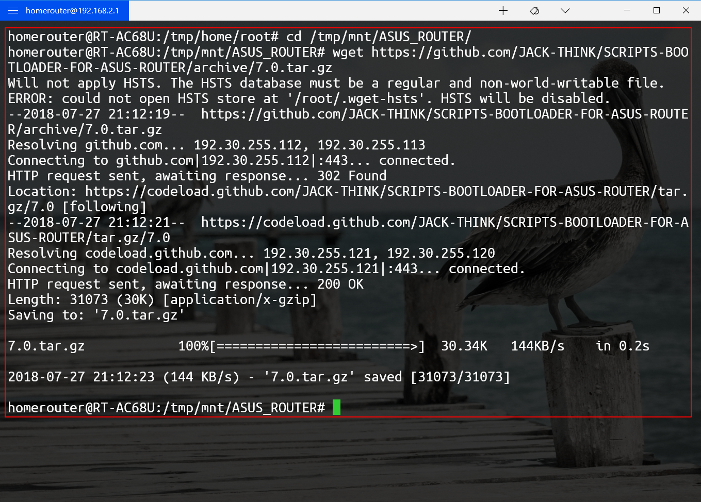

12. 执行`tar xzvf N.N.tar.gz`，将全部文件解压（`N.N`是版本号，请自己替换成所下载的版本号）

    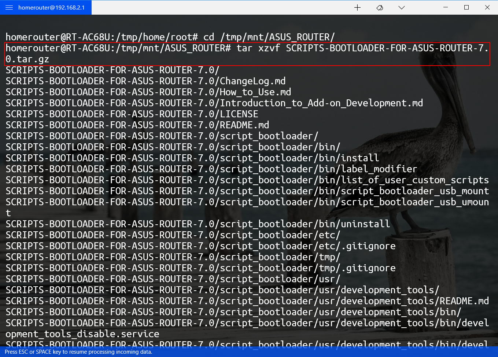

13. 执行`mv SCRIPTS-BOOTLOADER-FOR-ASUS-ROUTER-N.N/script_bootloader ./`（`N.N`是版本号，请自己替换成所下载的版本号）

    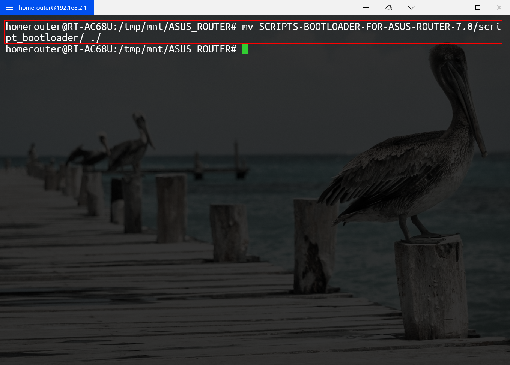

14. 执行`rm -rf SCRIPTS-BOOTLOADER-FOR-ASUS-ROUTER-N.N*`（`N.N`是版本号，请自己替换成所下载的版本号）

    

15. 执行`chown -R 路由器登录名（例如homerouter）:root script_bootloader/`改变全部文件属主

    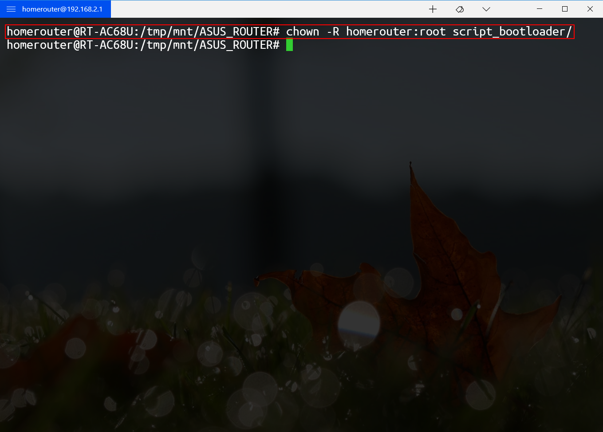

16. 执行`chmod -R 777 script_bootloader/`改变全部文件权限

    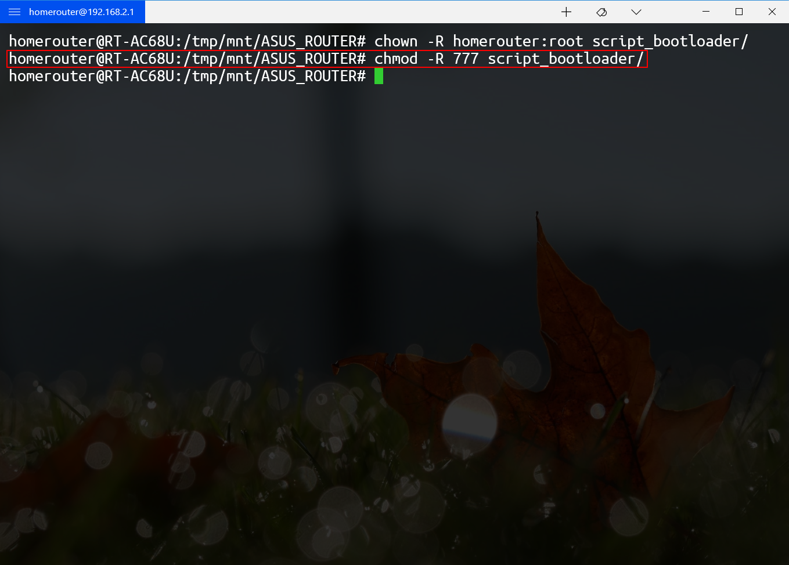

#### 修改程序

阅读每个程序文件的中文注释，按个人需求对程序进行修改

> 注意：
>
> - 在Windows下对程序进行修改，必须将编辑器的换行符设置为LF，否则程序将被损坏，无法运行
> - 在Linux下对程序进行修改，无需特别设置

#### 安装（按照下述顺序执行）

1. 用ssh登陆路由器后台

   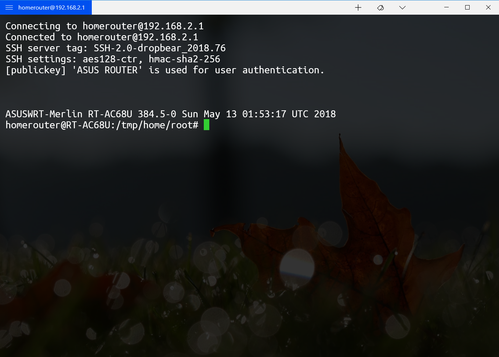

2. 执行`/tmp/mnt/ASUS_ROUTER/script_bootloader/bin/install`。路由器自动重启后，SCRIPTS BOOTLOADER FOR ASUS ROUTER系统安装完毕

   > 说明：
   >
   > 安装过程分为三阶段：
   >
   > 1. 阶段一：设置路由器
   >    - 全自动安装，无需用户参与
   >
   > 2. 阶段二：安装系统必备程序
   >    - 全自动安装，无需用户参与
   >    - 安装时间较长，请耐心等待
   >    - 在部署Python相关程序时，会出现一次黄字警告，三次红字警告，这是正常现象，无需担心
   >
   > 3. 阶段三：安装用户可选插件
   >    - 需用户按照屏幕所示插件列表，输入欲安装的插件序号，每次只能输入一个序号，\<Enter\>确认
   >    - 所选插件安装完毕后，重复上述过程，继续安装下一个插件
   >    - 所需插件全部安装完毕后，根据屏幕提示，键入`0`，结束可选插件安装
   >
   > 提示信息说明：
   >
   > 1. 紫底白字：安装阶段提示信息
   > 2. 绿底白字：安装成功提示信息
   > 3. 红底白字：安装失败提示信息
   >    - 出现错误时，其上面一行即错误详情及相关文件，可根据此信息排错

#### 启用/禁用插件

> 本系统插件管理由两个部分组成，如下表所示：
>
> | 插件管理者                  | 服务类型                                                 | 使用说明                                                     |
> | --------------------------- | -------------------------------------------------------- | ------------------------------------------------------------ |
> | list_of_user_custom_scripts | 仅需在开机时调用一次且无需监控的服务，例如修改环境变量等 | 见下文                                                       |
> | Monit进程管理系统           | 除上述类型外的全部服务                                   | [点击查看](https://github.com/JACK-THINK/SCRIPTS-BOOTLOADER-FOR-ASUS-ROUTER/blob/master/script_bootloader/usr/monit/README.md) |

1. 用ssh登陆路由器后台

   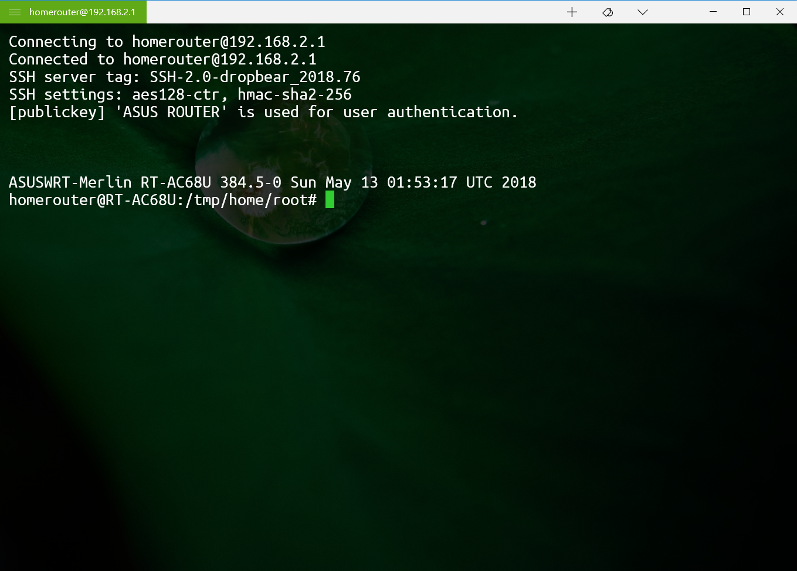

2. 执行`cd /tmp/mnt/ASUS_ROUTER/script_bootloader/bin/`，进入该目录

   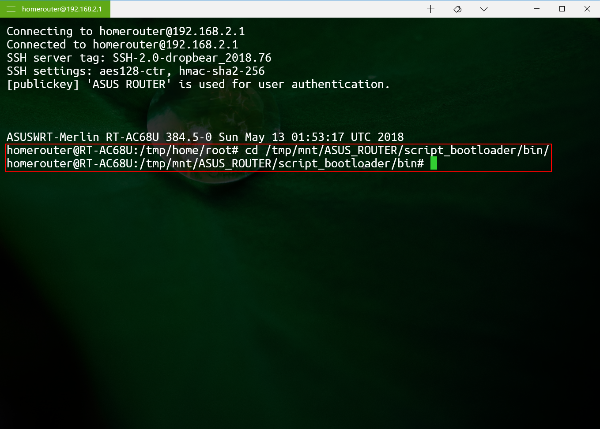

3. 使用`vi`或`nano`删除要启用的服务路径前的`#`（若要禁用某服务，仅需在要禁用的服务路径前插入`#`）

   > 注意：
   >
   > 1. 此步也可在Windows下完成修改，将修改好的list_of_user_custom_scripts文件上传至路由器`/tmp/mnt/ASUS_ROUTER/script_bootloader/bin/`目录中
   > 2. 各插件的README.md文件中已写明应删除`#`的具体行号，请参考

4. 保存并退出

5. 执行`reboot`，重启路由器，相应的服务将开机自动启动

   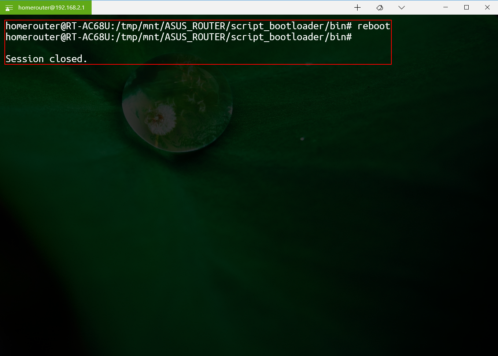

#### 卸载

1. 用ssh登陆路由器后台

   

2. 执行`/tmp/mnt/ASUS_ROUTER/script_bootloader/bin/uninstall`。路由器自动重启后，卸载完毕

   

#### 恢复

1. 执行路由器固件升级，需移除路由器上装有本系统的U盘
2. 路由器固件升级成功后，将之前装有本系统的U盘重新插入路由器
3. 执行`/tmp/mnt/ASUS_ROUTER/script_bootloader/bin/restore`即可在数秒内恢复本系统，无需费时全新安装