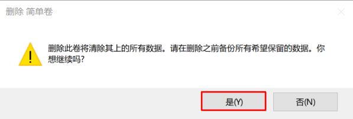
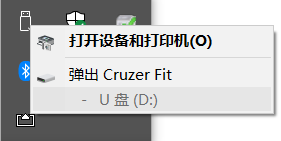
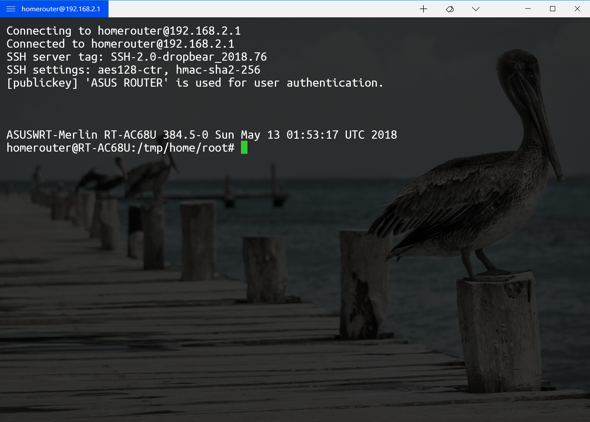
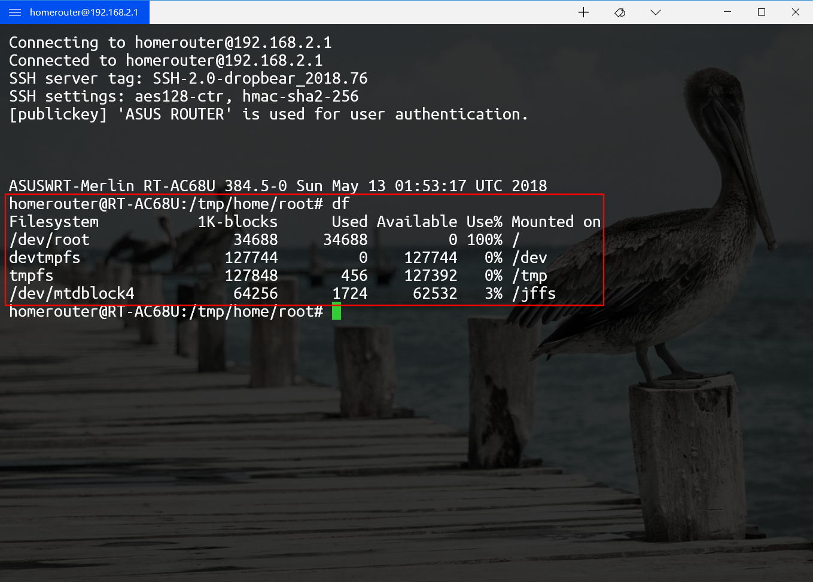
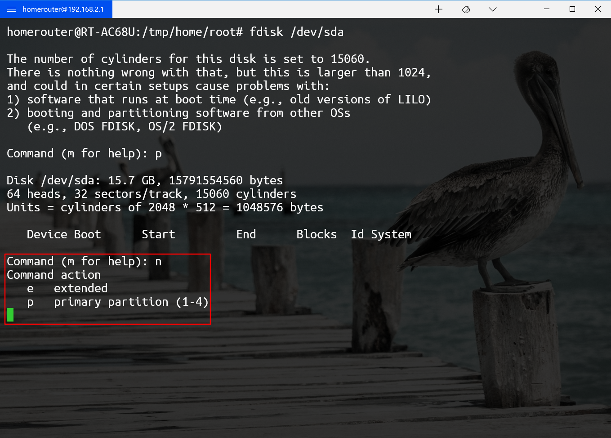
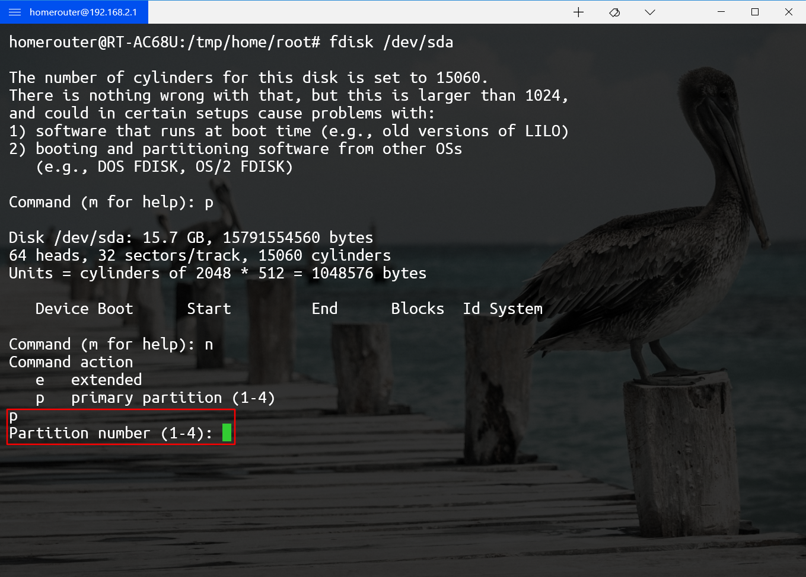
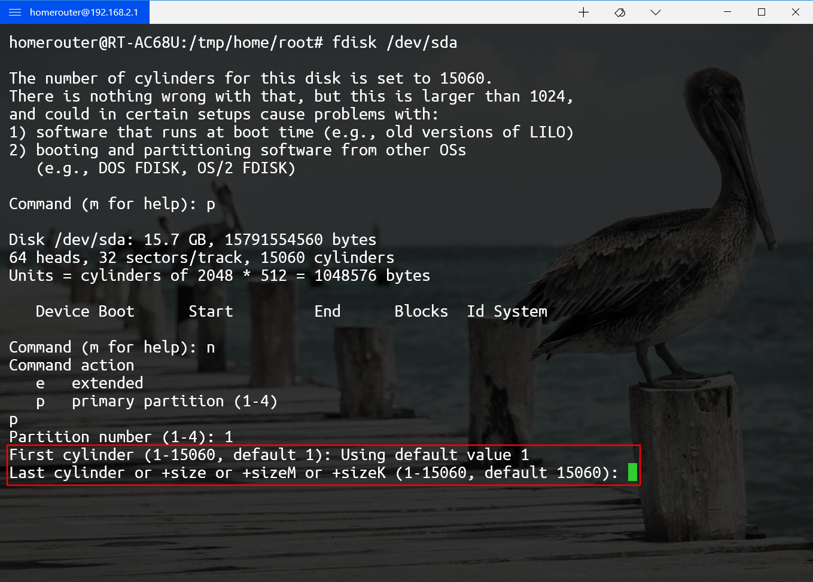
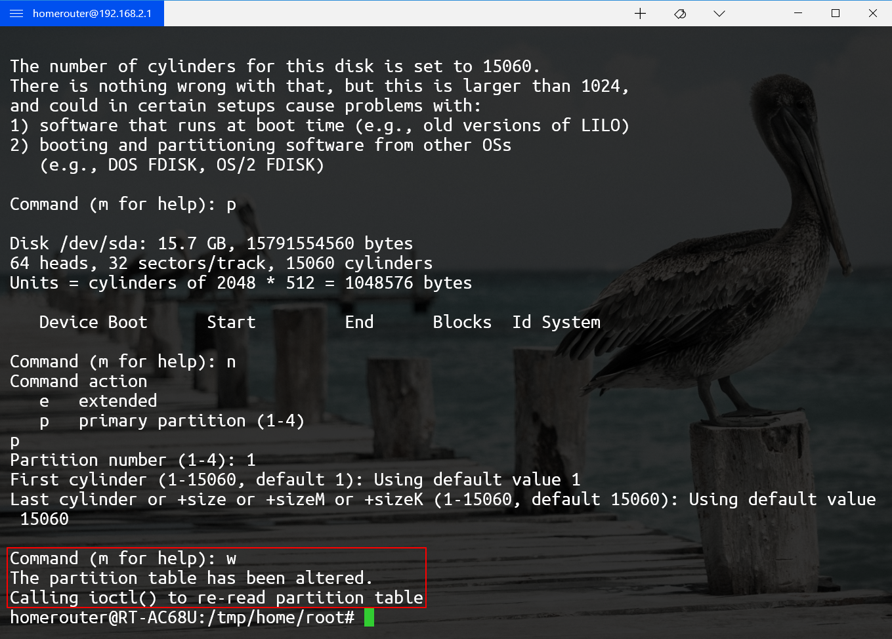
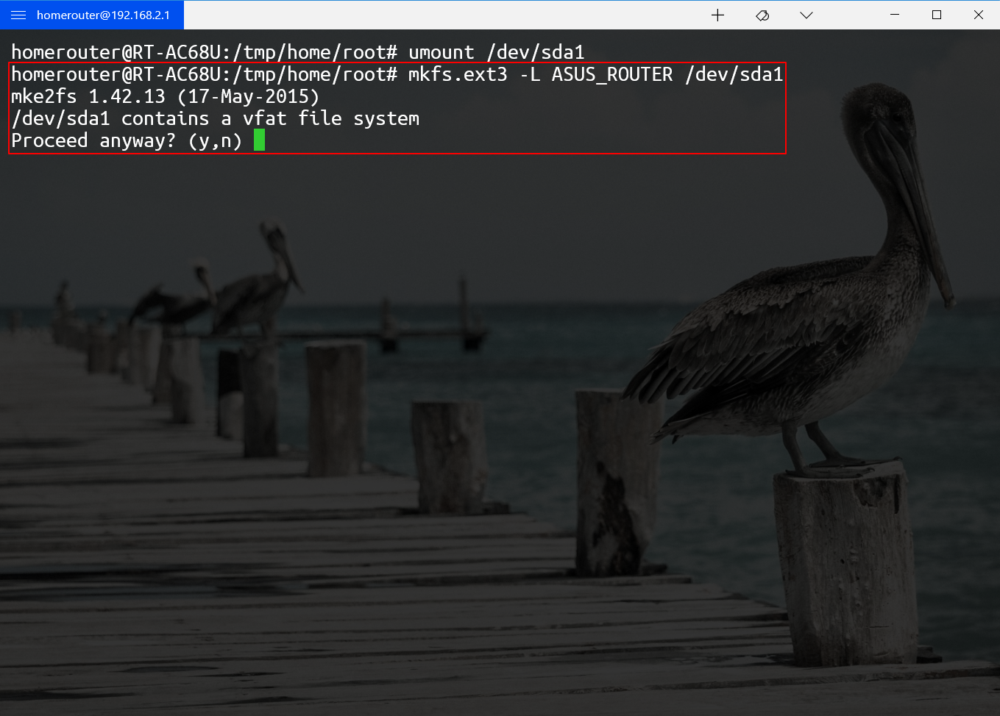
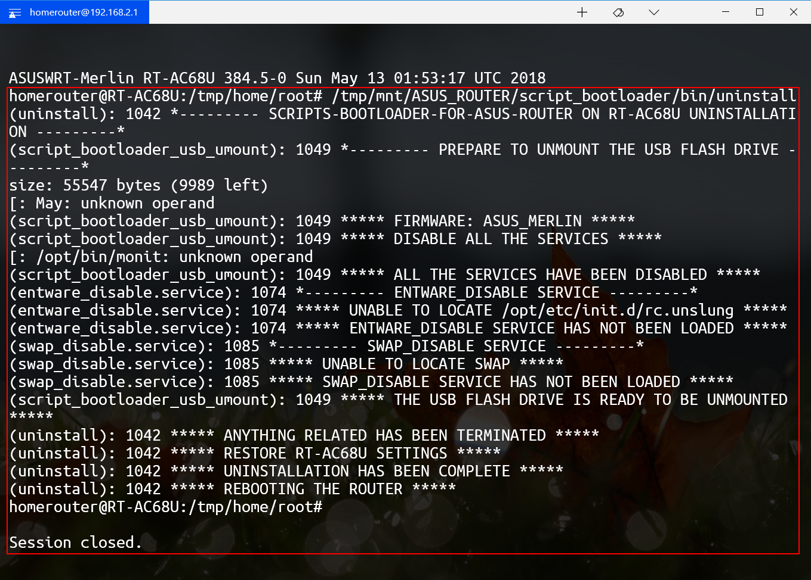

# SCRIPTS BOOTLOADER FOR ASUS ROUTER 使用说明

## 运行环境

华硕路由器官方固件和梅林固件

## 开机自动运行原理

1. 每次路由器启动时，都会自动挂载插入的U盘
2. 通过设置`script_usbmount`参数，可使路由器在成功挂载U盘后，自动执行该参数指向的任何可执行程序（本例中，该程序为`/tmp/mnt/ASUS_ROUTER/script_bootloader/script_bootloader_usb_mount`）
3. 设置被`script_usbmount`参数引用的程序（本例中，该程序为`/tmp/mnt/ASUS_ROUTER/script_bootloader/script_bootloader_usb_mount`），使其先确定路由器已经成功启动，然后调用用户自定义程序列表（本例中，该程序为`/tmp/mnt/ASUS_ROUTER/script_bootloader/bin/list_of_user_custom_scripts`），按顺序逐一执行用户的自定义程序

## 文件结构

`ASUS_ROUTER/`（U盘根目录）

| 权限      | 名称              | 属性 |
| --------- | ----------------- | ---- |
| rwxrwxrwx | script_bootloader | 目录 |

`ASUS_ROUTER/script_bootloader/`（SCRIPTS BOOTLOADER FOR ASUS ROUTER系统根目录）

| 权限      | 名称 | 属性 |
| --------- | ---- | ---- |
| rwxrwxrwx | bin  | 目录 |
| rwxrwxrwx | etc  | 目录 |
| rwxrwxrwx | tmp  | 目录 |
| rwxrwxrwx | usr  | 目录 |
| rwxrwxrwx | var  | 目录 |

`ASUS_ROUTER/script_bootloader/bin/`（SCRIPTS BOOTLOADER FOR ASUS ROUTER系统可执行文件目录）

| 权限      | 名称                           | 属性     |
| --------- | ------------------------------ | -------- |
| rwxrwxrwx | install                      | 普通文件 |
| rwxrwxrwx | uninstall                    | 普通文件 |
| rwxrwxrwx | script_bootloader_usb_mount  | 普通文件 |
| rwxrwxrwx | script_bootloader_usb_umount | 普通文件 |
| rwxrwxrwx | label_modifier               | 普通文件 |
| rwxrwxrwx | list_of_user_custom_scripts | 普通文件 |

`ASUS_ROUTER/script_bootloader/etc/`（SCRIPTS-BOOTLOADER-FOR-ASUS-ROUTER系统配置文件目录）

`ASUS_ROUTER/script_bootloader/tmp/`（SCRIPTS-BOOTLOADER-FOR-ASUS-ROUTER系统临时文件目录）

`ASUS_ROUTER/script_bootloader/var/`（SCRIPTS-BOOTLOADER-FOR-ASUS-ROUTER系统可变文件目录）

`ASUS_ROUTER/script_bootloader/usr/`（SCRIPTS-BOOTLOADER-FOR-ASUS-ROUTER系统外部软件资源目录，即插件目录）

| 权限      | 名称                             | 属性 |
| --------- | -------------------------------- | ---- |
| rwxrwxrwx | development_tools                | 目录 |
| rwxrwxrwx | entware                          | 目录 |
| rwxrwxrwx | monit                            | 目录 |
| rwxrwxrwx | swap                             | 目录 |
| rwxrwxrwx | 自定义程序名（本例中为software） | 目录 |

`ASUS_ROUTER/script_bootloader/usr/development_tools/`（插件development_tools目录）

| 权限      | 名称      | 属性     |
| --------- | --------- | -------- |
| rwxrwxrwx | README.md | 普通文件 |
| rwxrwxrwx | bin       | 目录     |
| rwxrwxrwx | etc       | 目录     |

`ASUS_ROUTER/script_bootloader/usr/development_tools/bin/`（插件development_tools可执行文件目录）

| 权限      | 名称                              | 属性     |
| --------- | --------------------------------- | -------- |
| rwxrwxrwx | development_tools_install         | 普通文件 |
| rwxrwxrwx | development_tools_enable.service  | 普通文件 |
| rwxrwxrwx | development_tools_disable.service | 普通文件 |

`ASUS_ROUTER/script_bootloader/usr/development_tools/etc/`（插件development_tools配置文件目录）

| 权限      | 名称                     | 属性     |
| --------- | ------------------------ | -------- |
| rwxrwxrwx | armv7l_list_of_packages  | 普通文件 |
| rwxrwxrwx | aarch64_list_of_packages | 普通文件 |

`ASUS_ROUTER/script_bootloader/usr/entware/`（插件entware目录）

| 权限      | 名称      | 属性     |
| --------- | --------- | -------- |
| rwxrwxrwx | README.md | 普通文件 |
| rwxrwxrwx | bin       | 目录     |

`ASUS_ROUTER/script_bootloader/usr/entware/bin/`（插件entware可执行文件目录）

| 权限      | 名称                    | 属性     |
| --------- | ----------------------- | -------- |
| rwxrwxrwx | entware_install         | 普通文件 |
| rwxrwxrwx | entware_enable.service  | 普通文件 |
| rwxrwxrwx | entware_disable.service | 普通文件 |

`ASUS_ROUTER/script_bootloader/usr/entware/etc/`（插件entware配置文件目录）

`ASUS_ROUTER/script_bootloader/usr/monit/`（插件monit目录）

| 权限      | 名称      | 属性     |
| --------- | --------- | -------- |
| rwxrwxrwx | README.md | 普通文件 |
| rwxrwxrwx | bin       | 目录     |
| rwxrwxrwx | etc       | 目录     |

`ASUS_ROUTER/script_bootloader/usr/monit/bin/`（插件monit可执行文件目录）

| 权限      | 名称                 | 属性     |
| --------- | -------------------- | -------- |
| rwxrwxrwx | monit_install        | 普通文件 |

`ASUS_ROUTER/script_bootloader/usr/monit/etc/`（插件monit可变文件目录）

| 权限      | 名称         | 属性     |
| --------- | ------------ | -------- |
| rwxrwxrwx | monit.d | 目录          |
| rwxrwxrwx | mmonitrc | 普通文件     |
| rwxrwxrwx | mmonitrc.bak | 普通文件 |

`ASUS_ROUTER/script_bootloader/usr/swap/`（插件swap目录）

| 权限      | 名称      | 属性     |
| --------- | --------- | -------- |
| rwxrwxrwx | README.md | 普通文件 |
| rwxrwxrwx | bin       | 目录     |
| rwxrwxrwx | var       | 目录     |

`ASUS_ROUTER/script_bootloader/usr/swap/bin/`（插件swap可执行文件目录）

| 权限      | 名称                 | 属性     |
| --------- | -------------------- | -------- |
| rwxrwxrwx | swap_install         | 普通文件 |
| rwxrwxrwx | swap_enable.service  | 普通文件 |
| rwxrwxrwx | swap_disable.service | 普通文件 |

`ASUS_ROUTER/script_bootloader/usr/swap/var/`（插件swap可变文件目录）

| 权限      | 名称         | 属性     |
| --------- | ------------ | -------- |
| rwxrwxrwx | swapfile.var | 普通文件 |

`ASUS_ROUTER/script_bootloader/usr/自定义程序名（本例中为software）/`（自定义程序，即插件的全部文件）

| 权限      | 名称      | 属性      |
| --------- | --------  | --------  |
| rwxrwxrwx | README.md | 普通文件  |
| rwxrwxrwx | bin       | 目录      |
| rwxrwxrwx | etc       | 目录      |
| rwxrwxrwx | tmp       | 目录      |
| rwxrwxrwx | usr       | 目录      |
| rwxrwxrwx | var       | 目录      |

`ASUS_ROUTER/script_bootloader/usr/自定义程序名（本例中为software）/bin/`（此程序可执行文件目录）

| 权限      | 名称                     | 属性     |
| --------- | ------------------------ | -------- |
| rwxrwxrwx | software_enable.service  | 普通文件 |
| rwxrwxrwx | software_disable.service | 普通文件 |

`ASUS_ROUTER/script_bootloader/usr/自定义程序名（本例中为software）/etc/`（此程序配置文件目录）

| 权限      | 名称          | 属性     |
| --------- | ------------- | -------- |
| rwxrwxrwx | software.conf | 普通文件 |

`ASUS_ROUTER/script_bootloader/usr/自定义程序名（本例中为software）/tmp/`（此程序临时文件目录）

| 权限      | 名称         | 属性     |
| --------- | ------------ | -------- |
| rwxrwxrwx | software.tmp | 普通文件 |

`ASUS_ROUTER/script_bootloader/usr/自定义程序名（本例中为software）/usr/`（此程序外部软件资源目录）

| 权限      | 名称     | 属性     |
| --------- | -------- | -------- |
| rwxrwxrwx | software | 普通文件 |

`ASUS_ROUTER/script_bootloader/usr/自定义程序名（本例中为software）/var/`（此程序可变文件目录）

| 权限      | 名称         | 属性     |
| --------- | ------------ | -------- |
| rwxrwxrwx | software.var | 普通文件 |

## 使用说明

#### 安装前准备

1. 准备一个空白U盘

   

2. 删除U盘上的全部分区

   

   

3. 弹出U盘，将其插入路由器的USB2.0插口（确保路由器**唯一**插入了此U盘）

   

4. 用ssh登陆路由器后台

   

5. 执行`df`，查看磁盘挂载情况。很明显，由于该U盘没有分区，所以路由器没有挂载

   

6. 对U盘分区
   - 执行`fdisk /dev/sda`

     

   - 输入`p`，查看分区表。很明显，由于该U盘没有分区

     

   - 输入`n`，创建新分区

     

   - 输入`p`，设置新分区类型为主分区

     

   - 输入`1`，设置主分区数量为1

     

   - 什么都不输，直接按回车，默认设置第一柱面为1

     

   - 什么都不输，直接按回车，默认设置最后柱面为最大值（取决于U盘容量）

     

   - 输入`w`，将分区表写入U盘

     

7. 执行`umount /dev/sda1`卸载U盘

   

8. 格式化U盘分区

   - 执行`mkfs.ext3 -L ASUS_ROUTER /dev/sda1`

     

   - 输入`y`，等待格式化完成

     

9. 格式化完成之后，执行`reboot`，重启路由器

   

10. 路由器重启后，重新用ssh登陆路由器后台，使用scp将文件`SCRIPTS-BOOTLOADER-FOR-ASUS-ROUTER-N.N.tar.gz`上传至路由器`/tmp/mnt/ASUS_ROUTER/`目录中（`N.N`是版本号，请自己替换成所下载的版本号）

11. 执行`cd /tmp/mnt/ASUS_ROUTER/`，进入该目录

    

12. 执行`tar xzvf SCRIPTS-BOOTLOADER-FOR-ASUS-ROUTER-N.N.tar.gz`，将全部文件解压（`N.N`是版本号，请自己替换成所下载的版本号）

    

13. 执行`mv SCRIPTS-BOOTLOADER-FOR-ASUS-ROUTER-N.N/script_bootloader ./`（`N.N`是版本号，请自己替换成所下载的版本号）

    

14. 执行`rm -rf SCRIPTS-BOOTLOADER-FOR-ASUS-ROUTER-N.N*`（`N.N`是版本号，请自己替换成所下载的版本号）

    

15. 执行`chown -R 路由器登录名（例如homerouter）:root script_bootloader/`改变全部文件属主

    

16. 执行`chmod -R 777 script_bootloader/`改变全部文件权限

    

#### 修改程序

阅读每个程序文件的中文注释，按个人需求对程序进行修改

> 注意：
>
> - 在Windows下对程序进行修改，必须将编辑器的换行符设置为LF，否则程序将被损坏，无法运行
> - 在Linux下对程序进行修改，无需特别设置

| 建议修改的文件              | 不建议修改的文件                  |
| --------------------------- | --------------------------------- |
| list_of_user_custom_scripts | install                           |
|                             | uninstall                         |
|                             | script_bootloader_usb_mount       |
|                             | script_bootloader_usb_umount      |
|                             | label_modifier                    |
|                             | entware_install                   |
|                             | entware_enable.service            |
|                             | entware_disable.service           |
|                             | swap_install                      |
|                             | swap_enable.service               |
|                             | swap_disable.service              |
|                             | development_tools_install         |
|                             | development_tools_enable.service  |
|                             | development_tools_disable.service |
|                             | armv7l_list_of_packages           |
|                             | aarch64_list_of_packages          |

#### 安装（按照下述顺序执行）

1. 用ssh登陆路由器后台

   

2. 执行`/tmp/mnt/ASUS_ROUTER/script_bootloader/bin/install`。路由器自动重启后，SCRIPTS BOOTLOADER FOR ASUS ROUTER系统安装完毕

   

3. （可选）执行`/tmp/mnt/ASUS_ROUTER/script_bootloader/usr/swap/bin/swap_install`。安装512M虚拟内存。[查看详情](https://github.com/JACK-THINK/SCRIPTS-BOOTLOADER-FOR-ASUS-ROUTER/blob/master/script_bootloader/usr/swap/README.md)

4. （可选）执行`/tmp/mnt/ASUS_ROUTER/script_bootloader/usr/entware/bin/entware_install`。程序会根据路由器架构，自动安装适当版本的Entware。[查看详情](https://github.com/JACK-THINK/SCRIPTS-BOOTLOADER-FOR-ASUS-ROUTER/blob/master/script_bootloader/usr/entware/README.md)

   > [受支持的路由器型号](https://github.com/Entware/Entware/wiki/Install-on-Asus-stock-firmware)：
   >
   > | 架构        | 路由器型号                                                   |
   > | ----------- | ------------------------------------------------------------ |
   > | **aarch64** | RT-AC86U                                                     |
   > | **armv7**   | RT-AC68U, RT-AC56U, RT-AC87U, RT-AC3200, RT-AC88U, RT-AC3100, RT-AC5300, GT-AC5300 |
   > | **mipsel**  | RT-N66U, RT-AC66U, RT-N16                                    |

5. （可选）执行`/tmp/mnt/ASUS_ROUTER/script_bootloader/usr/monit/bin/monit_install`。安装进程管理器Monit。[查看详情](https://github.com/JACK-THINK/SCRIPTS-BOOTLOADER-FOR-ASUS-ROUTER/blob/master/script_bootloader/usr/monit/README.md)

   > [受支持的路由器型号](https://github.com/Entware/Entware/wiki/Install-on-Asus-stock-firmware)：
   >
   > | 架构        | 路由器型号                                                   |
   > | ----------- | ------------------------------------------------------------ |
   > | **aarch64** | RT-AC86U                                                     |
   > | **armv7**   | RT-AC68U, RT-AC56U, RT-AC87U, RT-AC3200, RT-AC88U, RT-AC3100, RT-AC5300, GT-AC5300 |
   > | **mipsel**  | RT-N66U, RT-AC66U, RT-N16                                    |

6. （可选）执行`/tmp/mnt/ASUS_ROUTER/script_bootloader/usr/development_tools/bin/development_tools_install`。程序会根据路由器架构，自动安装适当版本的development_tools。[查看详情](https://github.com/JACK-THINK/SCRIPTS-BOOTLOADER-FOR-ASUS-ROUTER/blob/master/script_bootloader/usr/development_tools/README.md)

   > [受支持的路由器型号](https://github.com/Entware/Entware/wiki/Install-on-Asus-stock-firmware)：
   >
   > | 架构        | 路由器型号                                                   |
   > | ----------- | ------------------------------------------------------------ |
   > | **aarch64** | RT-AC86U                                                     |
   > | **armv7**   | RT-AC68U, RT-AC56U, RT-AC87U, RT-AC3200, RT-AC88U, RT-AC3100, RT-AC5300, GT-AC5300 |

7. （可选）其余插件的安装方法请参阅各插件目录中的README.md文件，此处不另作说明

#### 卸载

1. 用ssh登陆路由器后台

   

2. 执行`/tmp/mnt/ASUS_ROUTER/script_bootloader/bin/uninstall`。路由器自动重启后，卸载完毕

   