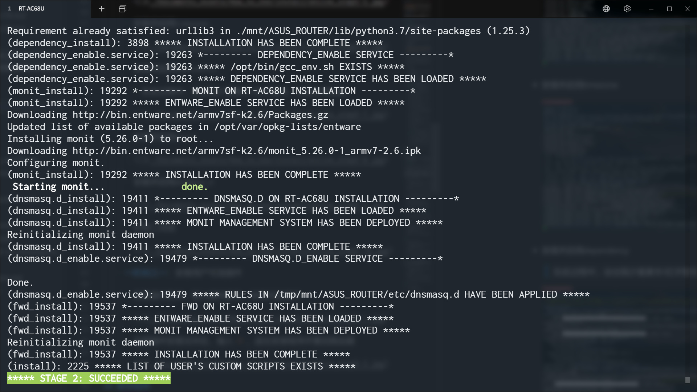

# SCRIPTS BOOTLOADER FOR ASUS ROUTER 使用说明

[中文](./How_to_Use_zh-CN.md) | [English](./How_to_Use_en-US.md)

## 运行环境

- [Asuswrt](https://www.asus.com.cn)：官方华硕路由器固件
- [Asuswrt-Merlin](https://www.asuswrt-merlin.net/)：享誉全球的第三方华硕路由器固件

> 警告：除上述固件外，本系统不保证兼容其它固件

## 注意事项

1. 确保用于登录路由器Web页面的用户名和密码**不含有**除*大小写字母、数字、下划线*之外的其它任何字符

## 在线安装

> **提示信息说明**
>
> 1. 紫底白字：安装阶段提示信息
> 2. 绿底白字：安装成功提示信息
> 3. 红底白字：安装失败提示信息
>    - 出现错误时，其上面一行即错误详情及相关文件，可根据此信息排错

1. 准备一个空白U盘，插入路由器USB接口

2. 用ssh登陆路由器后台

   

3. 执行下列代码

   ```shell
   cd /tmp && wget -q -O /tmp/install_online --no-check-certificate "https://raw.githubusercontent.com/JACK-THINK/SCRIPTS-BOOTLOADER-FOR-ASUS-ROUTER/master/script_bootloader/bin/install_online" && chmod 777 /tmp/install_online && /tmp/install_online
   ```

   

4. 阅读提示信息，确认无误后，输入`YES`继续安装

   

5. 安装过程开始

   - 重新分区并格式化U盘

     

   - 下载安装文件

     

   - 创建安装日志

     

   - **阶段一**：设置路由器

     

   - **阶段二**：安装系统必备程序

     - 安装并启用虚拟内存（512M）

       

     - 安装并启用entware

       

     - 安装并启用timezone

       

     - 安装并启用dependency

       > 在此过程中，会出现少量黄字/红字警告，这是正常现象

       

     - 安装并启用monit

       

     - 安装并启用dnsmasq.d

       

     - 安装fwd

       

     - 注册用户自定义插件（无需监控类型）

       

     - 阶段二完成

       

   - **阶段三**：安装用户可选插件

     - 阅读插件菜单，输入插件编号，安装对应插件

       

     - 插件安装成功，安装下一个插件

       

     - 全部插件安装完毕后，输入`0`，退出安装程序并重启路由器

       

## 离线安装

> **说明**
>
> 1. 以下出现的所有`SCRIPTS-BOOTLOADER-FOR-ASUS-ROUTER-15.0-15.0`中的版本号部分（即`15.0-15.0`）会随着系统更新而改变。输入命令时请替换为最新版本号（可使用\<Tab\>键自动补全）

1. 准备一个空白U盘，插入路由器USB接口

2. 用ssh登陆路由器后台

3. 下载最新版安装包（[国内下载地址](https://github.com/JACK-THINK/SCRIPTS-BOOTLOADER-FOR-ASUS-ROUTER/wiki/使用说明索引#系统使用说明)），并将其上传至路由器`/tmp/home/root`

   

4. 执行下列代码，解压安装包

   ```shell
   cd /tmp/home/root
   tar -xzvf SCRIPTS-BOOTLOADER-FOR-ASUS-ROUTER-15.0-15.0.tar.gz
   rm -f SCRIPTS-BOOTLOADER-FOR-ASUS-ROUTER-15.0-15.0.tar.gz
   ```

5. 执行下列代码，将文件移动至指定位置并修改程序权限

   ```shell
   mv SCRIPTS-BOOTLOADER-FOR-ASUS-ROUTER-15.0-15.0/script_bootloader/ ./
   rm -rf SCRIPTS-BOOTLOADER-FOR-ASUS-ROUTER-15.0-15.0/
   chmod -R 777 script_bootloader/
   cp script_bootloader/bin/prerequisite_checker /tmp/
   cp script_bootloader/bin/drive_modifier /tmp/
   cd /tmp
   ```

6. 执行下列代码，检查安装环境。如无输出，则表示通过

   ```shell
   /tmp/prerequisite_checker
   ```

7. 执行下列代码，重新分区并格式化U盘

   ```shell
   /tmp/drive_modifier
   ```

8. 执行下列代码，将文件移动至指定位置

   ```shell
   mv /tmp/home/root/script_bootloader /tmp/mnt/ASUS_ROUTER/
   ```

9. 执行下列代码，开始安装

   ```shell
   /tmp/mnt/ASUS_ROUTER/script_bootloader/bin/install
   ```

10. （可选）如果固件中没有`tee`命令，则安装程序会在输出`***** STAGE 3: INSTALL ADDONS *****`后自动退出。执行下列代码，安装插件

   ```shell
   /tmp/mnt/ASUS_ROUTER/script_bootloader/bin/addons_install
   ```

11. 全部插件安装完毕后，执行下列代码，重启路由器

   ```shell
   reboot
   ```

## 修改程序

阅读`/opt/script_bootloader/usr/`中各个插件的README_zh-CN.md文件，按要求对相关程序进行修改

> **注意**
>
> - 在Windows下对程序进行修改，必须将编辑器的换行符设置为LF，否则程序将被损坏，无法运行
> - 在Linux下对程序进行修改，无需特别设置

## 启用/禁用插件

> 本系统插件管理由两个部分组成，如下表所示：
>
> | 插件管理者 | 插件类型 | 使用说明 |
> | ---------- | -------- | -------- |
> | list_of_user_custom_scripts | 仅需在开机时调用一次且无需监控的插件，例如修改环境变量等 | 见下文 |
> | Monit进程管理系统 | 除上述类型外的全部插件 | [点击查看](./script_bootloader/usr/monit/README_zh-CN.md) |

1. 用ssh登陆路由器后台

   

2. 执行下列代码，编辑文件list_of_user_custom_scripts

   ```shell
   vim /opt/script_bootloader/bin/list_of_user_custom_scripts
   ```

   

   

3. 启用/禁用特定插件

   - 启用插件：在插件路径前删除`#`
   - 禁用插件：在插件路径前插入`#`

   

4. 保存并退出

   \<ESC\>→\<:\>→\<w\>→\<q\>→\<Enter\>

5. 执行`reboot`，重启路由器，相应的插件将在开机时自动启动

   

## 升级

1. 用ssh登陆路由器后台

   

2. 执行下列代码升级本系统

   ```shell
   cd /tmp && /tmp/mnt/ASUS_ROUTER/script_bootloader/bin/update
   ```

   

## 卸载

1. 用ssh登陆路由器后台

   

2. 执行下列代码卸载本系统

   ```shell
   cd /tmp && /tmp/mnt/ASUS_ROUTER/script_bootloader/bin/uninstall
   ```

   

## 还原

> 执行路由器固件升级，需移除路由器上装有本系统的U盘。路由器固件升级成功后，将之前装有本系统的U盘重新插入路由器

1. 用ssh登陆路由器后台

   

2. 执行下列代码还原本系统

   ```shell
   cd /tmp && /tmp/mnt/ASUS_ROUTER/script_bootloader/bin/restore
   ```

   

## 重装

1. 执行[卸载](#卸载)

2. 执行[安装](#在线安装)