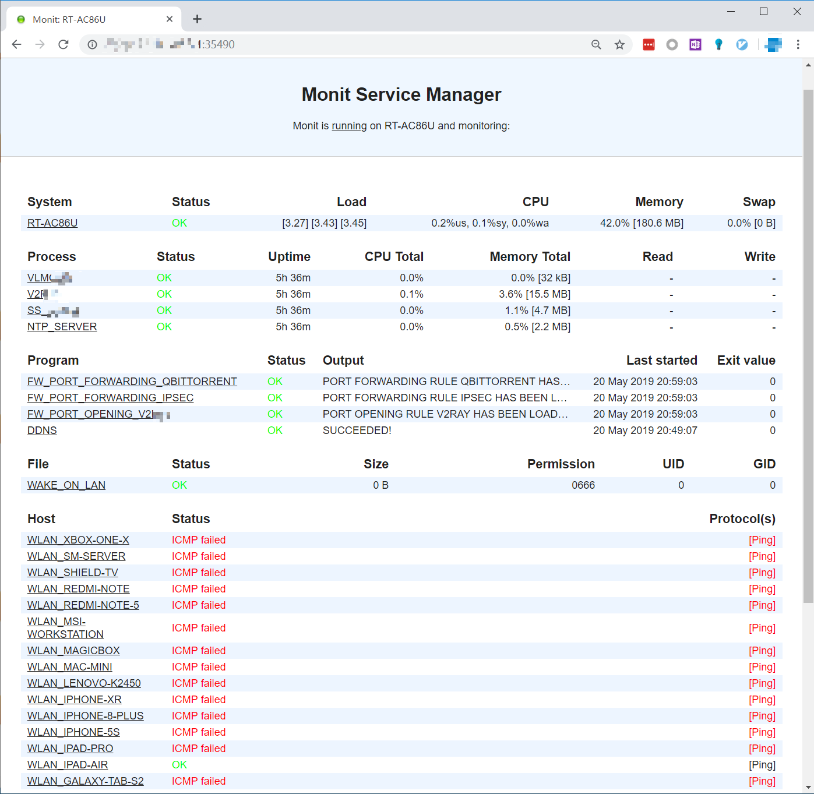

# SCRIPTS BOOTLOADER FOR ASUS ROUTER 介绍

[中文](./README.md) | [English](./README_en-US.md)

## 开发背景

1. 网上流传的关于华硕路由器官方固件开机自动运行程序的方法，或已经失效，或程序逻辑特别复杂，用起来非常麻烦且难以控制

2. 绝大部分方法都需要将至少一个程序写入路由器的`/jffs`分区。根据[梅林固件](https://www.asuswrt-merlin.net/)的原作者，这样做会缩短路由器的寿命，因为其闪存芯片的写入次数很少，一旦写入次数太多，路由器将损坏！！！[参考](https://github.com/RMerl/asuswrt-merlin/wiki/JFFS)

3. 根据个人使用经验，梅林固件本身的稳定性并不算太高（比如经常出现web页面崩溃的问题），而且一些华硕原厂固件的特定功能并不能得到及时更新（例如AiMesh）

因此，本人写了一个可同时运行于华硕路由器官方固件和梅林固件的，且无需向/jffs分区写入任何内容的开机启动引导程序

## 功能介绍

1. 路由器开机后自动运行U盘中的指定程序，允许用户自行扩展路由器功能

2. 全新编写[Entware](https://entware.net/)自动安装程序。程序会根据路由器架构，自动安装适当版本的Entware，无需用户参与安装过程

3. 默认提供512M虚拟内存，自动安装，确保运行流畅

4. 配备一键安装程序（系统）和插件安装菜单，便于使用

5. 配备Web管理页面（基于[Monit](https://mmonit.com/monit/)管理系统），方便进行插件的启停

## 程序特色

1. 所有程序（含Entware）均可运行于华硕路由器官方固件和梅林固件

2. 所有程序均使用Shell Script编写，语言风格统一

3. 所有程序代码格式统一，均配有详尽的中、英文注释（中英文对照），几乎解释了全部代码，易读、易懂、易改、易用

4. 程序组织逻辑清晰，程序命名清晰表达其功能，目录结构合理

5. 所有程序（含Entware）仅使用U盘，完全不依赖路由器`/jffs`分区，延长路由器使用寿命

6. 本程序可部署于U盘中的任何目录层级

7. 允许用户在路由器上插入多个U盘，不会发生任何冲突

## 在线安装

1. 备份目标U盘（不小于4GB）全部数据并将其连接至路由器

2. 移除其它全部U盘

3. 使用`ssh`登陆路由器并执行下述代码，按照屏幕提示完成安装（本地安装方法见[使用说明](./How_to_Use.md)）

   ```shell
   cd /tmp && wget -O /tmp/install_online --no-check-certificate "https://raw.githubusercontent.com/JACK-THINK/SCRIPTS-BOOTLOADER-FOR-ASUS-ROUTER/master/script_bootloader/bin/install_online" && chmod 777 /tmp/install_online && /tmp/install_online
   ```

   > 安装过程分为三阶段：
   >
   > 1. 阶段一：设置路由器
   >    - 全自动安装，无需用户参与
   >
   > 2. 阶段二：安装系统必备程序
   >    - 全自动安装，无需用户参与
   >    - 安装时间较长，请耐心等待
   >    - 在部署Python相关程序时，会出现一次黄字警告，三次红字警告，这是正常现象，无需担心
   >
   > 3. 阶段三：安装用户可选插件
   >    - 需用户按照屏幕所示插件列表，输入欲安装的插件序号，每次只能输入一个序号，\<Enter\>确认
   >    - 所选插件安装完毕后，重复上述过程，继续安装下一个插件
   >    - 所需插件全部安装完毕后，根据屏幕提示，键入`0`，结束可选插件安装
   >    - 路由器将自动重启

4. 安装完毕路由器重启后，打开浏览器，访问

   ```
   http://<路由器IP地址>:35490
   
   用户名：admin
   密码：monit
   ```

   管理已安装插件

   

## 更多资料

[使用说明](./How_t.md)

[更新日志](./Chan.md)

[下载地址](https://github.com/JACK-THINK/SCRIPTS-BOOTLOADER-FOR-ASUS-ROUTER/releases)