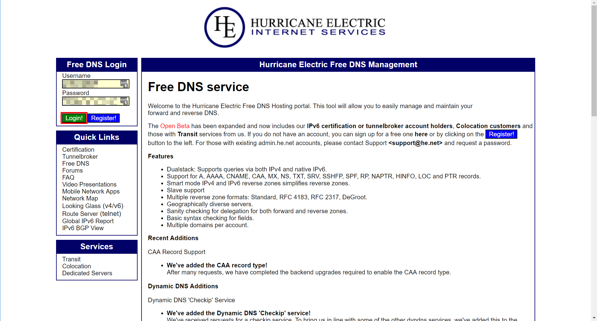
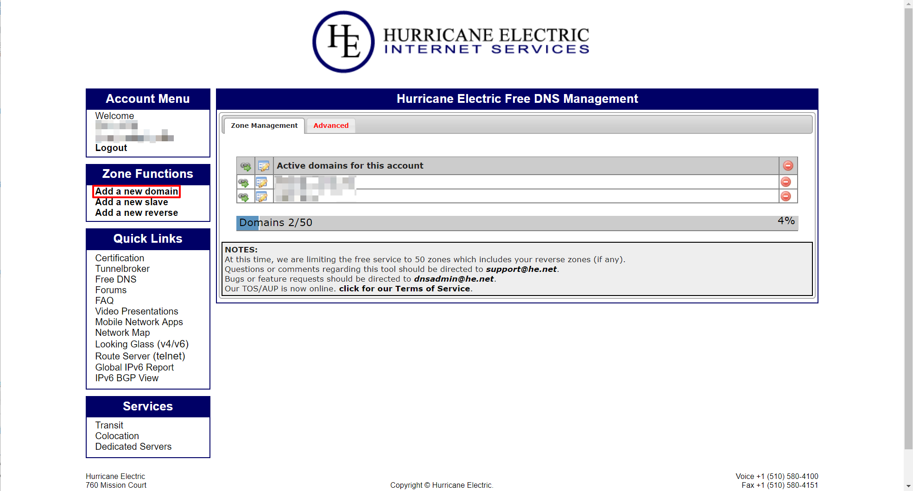
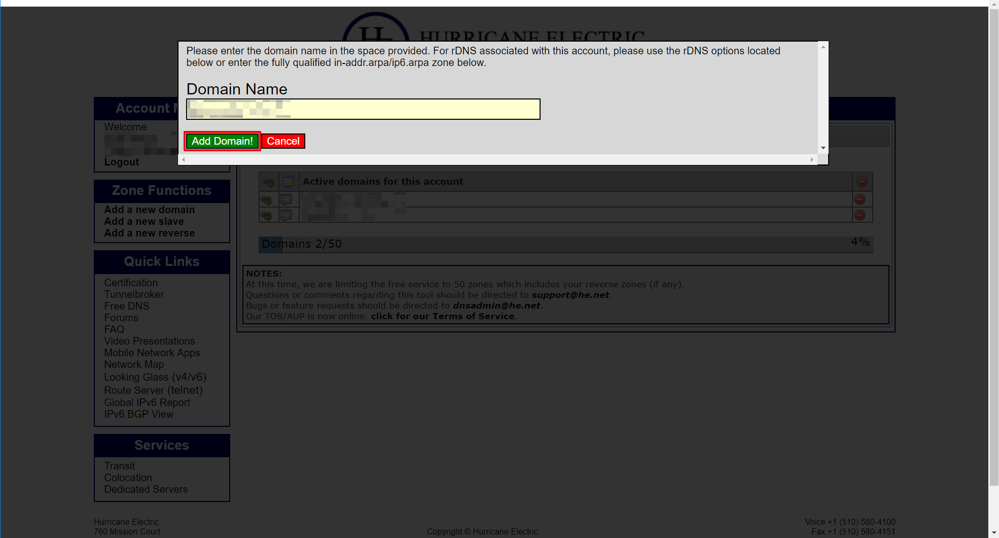
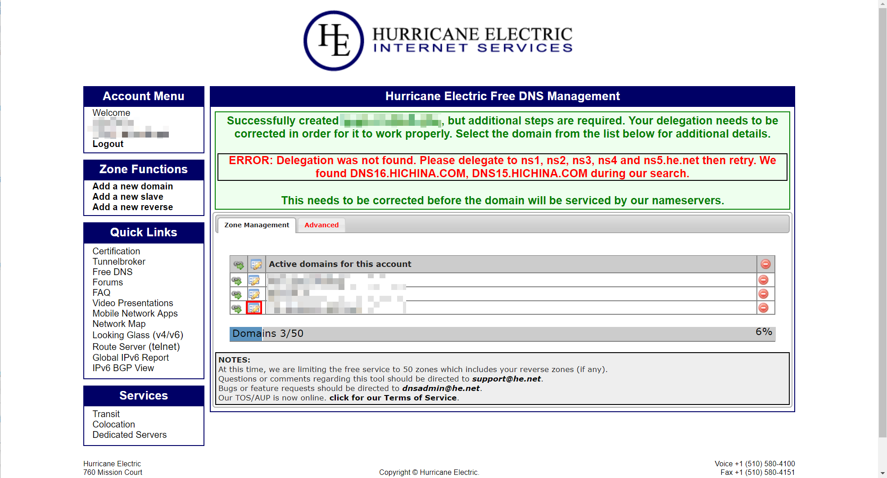
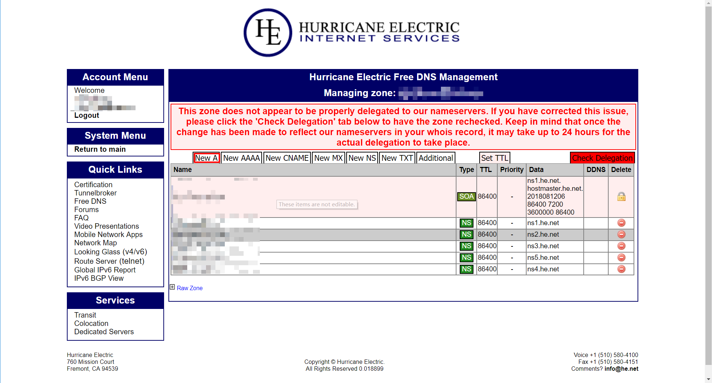
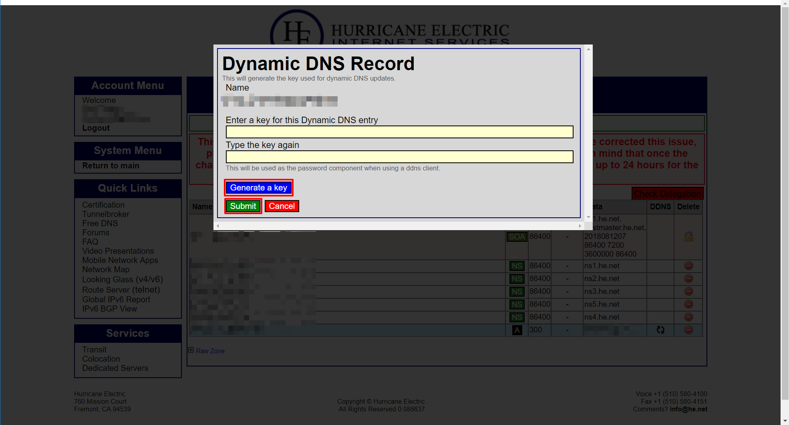

# Readme for he_ddns

## 概述

1. 本插件用于启动和结束he_ddns
2. 该插件仅适用于使用HE.NET作为DNS服务提供商的域名
3. 安装本插件后，可直接实现DDNS，不依赖华硕路由器固件中DDNS客户端
4. 当路由器通过PPPoE方式拨号上网时，若获得的IP地址为私有IP，则自动禁用DDNS服务，并向指定邮箱发送提醒邮件

## 安装前提

1. 必须安装并启用entware和monit

## 文件结构

`ASUS_ROUTER/script_bootloader/usr/he_ddns/`

| 权限      | 名称      | 属性     | 说明             |
| --------- | --------- | -------- | ---------------- |
| rwxrwxrwx | README_zh-CN.md | 普通文件 | 说明文件         |
| rwxrwxrwx | bin       | 目录     | 可执行文件目录   |
| rwxrwxrwx | etc       | 目录     | 配置文件目录     |
| rwxrwxrwx | tmp       | 目录     | 临时文件目录     |
| rwxrwxrwx | usr       | 目录     | 外部软件资源目录 |

`ASUS_ROUTER/script_bootloader/usr/he_ddns/bin/`

| 权限      | 名称                    | 属性     | 说明                                 |
| --------- | ----------------------- | -------- | ------------------------------------ |
| rwxrwxrwx | he_ddns_install         | 普通文件 | 安装程序                             |
| rwxrwxrwx | he_ddns_configure       | 普通文件 | 安装程序                             |
| rwxrwxrwx | he_ddns_enable.service  | 普通文件 | 更新DDNS记录或发送邮件主程序         |
| rwxrwxrwx | he_ddns_disable.service | 普通文件 | 更新DDNS记录为无效地址并停止DDNS服务 |

`ASUS_ROUTER/script_bootloader/usr/he_ddns/etc/`

| 权限      | 名称            | 属性     | 说明            |
| --------- | --------------- | -------- | --------------- |
| rwxrwxrwx | monit.d/he_ddns | 普通文件 | monit.d配置文件 |

`ASUS_ROUTER/script_bootloader/usr/he_ddns/tmp/`

| 权限      | 名称     | 属性     | 说明                       |
| --------- | -------- | -------- | -------------------------- |
| rwxrwxrwx | mail.tmp | 普通文件 | 使用curl发送邮件时自动生成 |

`ASUS_ROUTER/script_bootloader/usr/he_ddns/usr/`

| 权限      | 名称                 | 属性     | 说明                           |
| --------- | -------------------- | -------- | ------------------------------ |
| rwxrwxrwx | NO_PUBLIC_IP_ADDRESS | 普通文件 | 通知邮件文件（用于无公网IP时） |

## 安装方法

执行`/tmp/mnt/ASUS_ROUTER/script_bootloader/usr/he_ddns/bin/he_ddns_install`

## 调用方法

| 插件文件                | 插件调用者      |
| ----------------------- | --------------- |
| he_ddns_enable.service  | monit.d/he_ddns |
| he_ddns_disable.service | monit.d/he_ddns |

## 使用方法

> 1. 以下教程使用阿里云域名为例，其他提供商的域名管理方法大同小异，不另行作具体说明
> 2. 在域名服务商处购买的域名一般为顶级域名（格式为：`XXX.XXX`）

#### 配置DNS.HE.NET

1. 登录<https://dns.he.net>

   

2. 单击“Add a new domain”

   

3. 在“Domain Name”中，填入将要使用的顶级域名（格式为：`XXX.XXX`）并单击“Add Domain!”

   

4. 页面提示“域名添加成功”

   

#### 修改域名DNS服务器

1. 登录域名管理控制台，找到要使用的域名，单击“管理”

   

2. 在该域名管理页面中，单击“修改DNS”

   

3. 在DNS管理页面中，单击“修改DNS服务器”

   

4. 将该域名的默认DNS服务器变更为HE.NET提供的DNS服务器

   

5. 修改完成后，需等待2-24小时，方可生效

#### 添加DDNS记录

1. 找到新添加的域名，单击下图红框处“Edit”图标

   

2. 单击“New A”

   

3. 填入如下内容并单击“Submit”

   > - Name：填入要使用的二级域名（格式为：`XXX.XXX.XXX`）
   > - IPv4 Address：随便填入一个IP地址，默认为本机IP
   > - TTL (Time to live)：5 minutes
   > - Enable entry for dynamic dns：必选

   

4. 单击“Generate a DDNS key”图标

   

5. 单击“Generate a key”后，两个文本框内会自动填写“DDNS Key”，**记录**并单击“Submit”

   