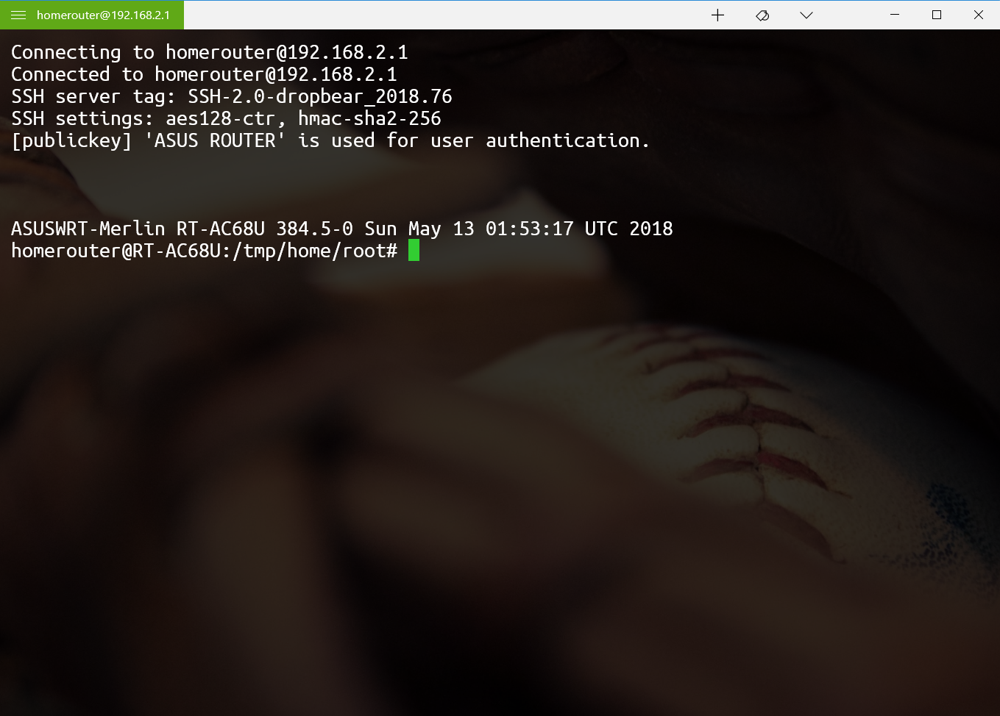
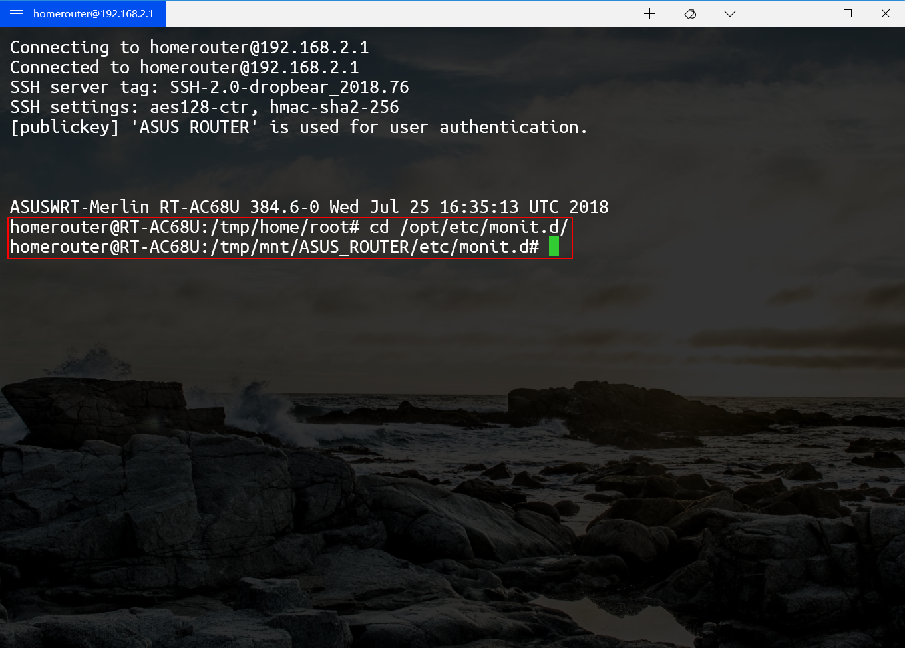
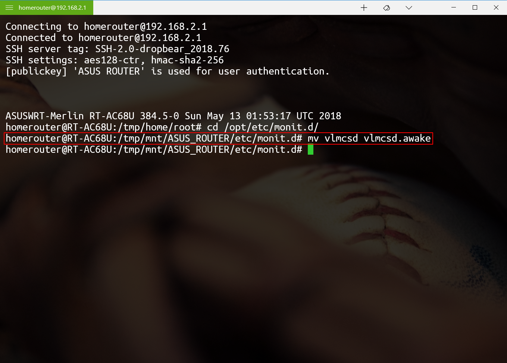
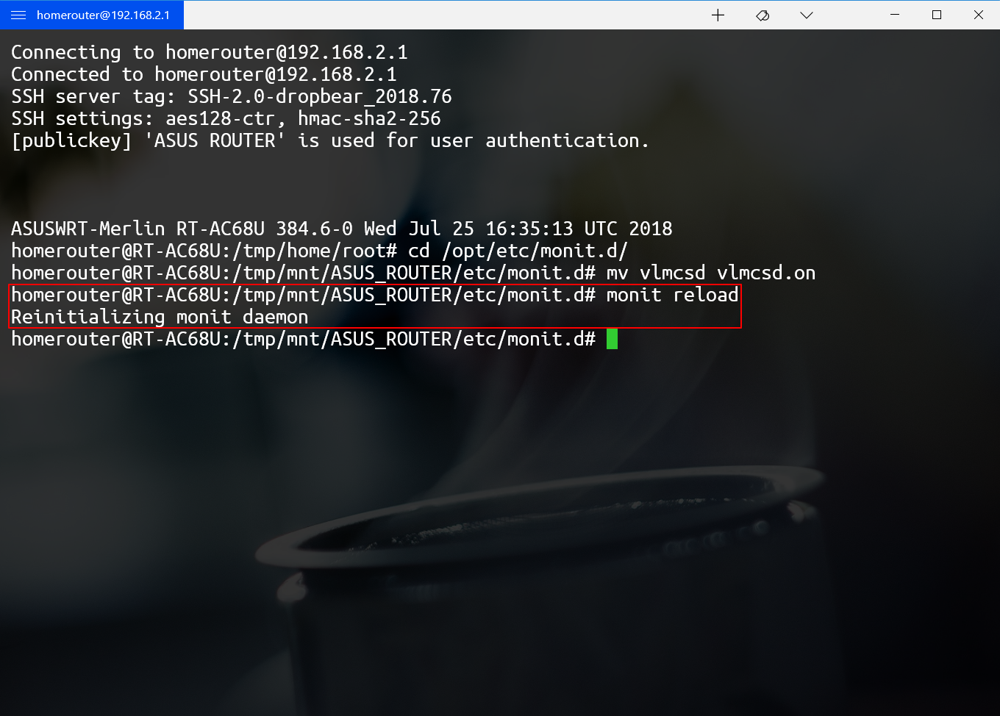
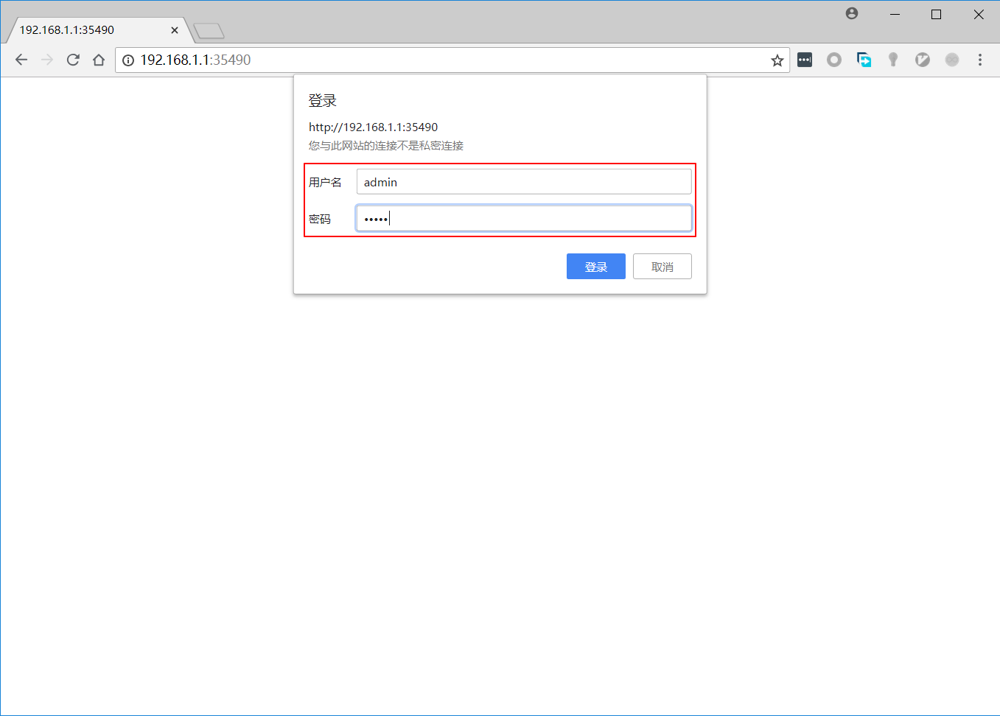
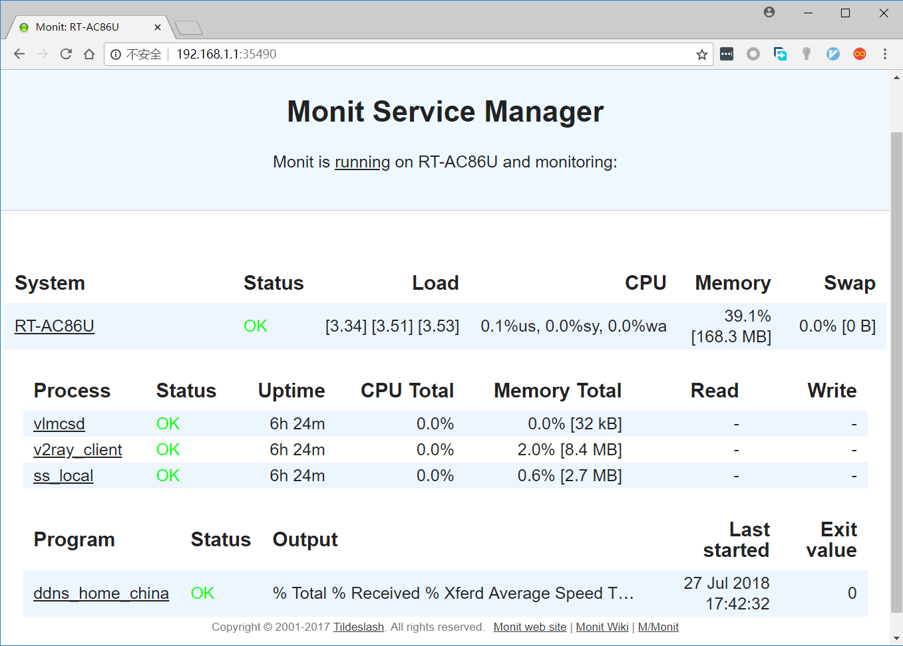
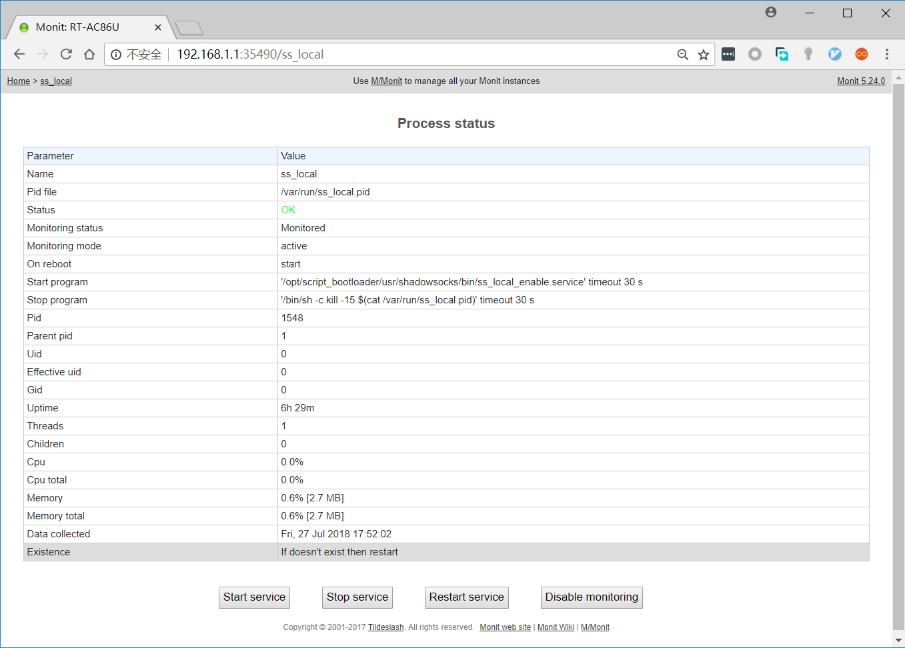

# Readme for monit

## 概述

1. 本插件用于安装、配置Monit进程管理系统

## 安装前提

1. 必须安装并启用entware

## 文件结构

`ASUS_ROUTER/script_bootloader/usr/monit/`

| 权限      | 名称      | 属性     | 说明             |
| --------- | --------- | -------- | ---------------- |
| rwxrwxrwx | README.md | 普通文件 | 说明文件         |
| rwxrwxrwx | bin       | 目录     | 可执行文件目录   |
| rwxrwxrwx | etc       | 目录     | 配置文件目录 |

`ASUS_ROUTER/script_bootloader/usr/monit/bin/`

| 权限      | 名称                 | 属性     | 说明                                                         |
| --------- | -------------------- | -------- | ------------------------------------------------------------ |
| rwxrwxrwx | monit_install         | 普通文件 | 插件的安装程序                                               |

`ASUS_ROUTER/script_bootloader/usr/monit/etc/`

| 权限      | 名称         | 属性     | 说明         |
| --------- | ------------ | -------- | ------------ |
| rwxrwxrwx | monit.d | 目录 | 各服务监控配置文件目录 |
| rwxrwxrwx | mmonitrc | 普通文件 | monit配置文件 |
| rwxrwxrwx | mmonitrc.bak | 普通文件 | 安装时自动生成 |

## 安装方法

执行`/tmp/mnt/ASUS_ROUTER/script_bootloader/usr/monit/bin/monit_install`

   > [受支持的路由器型号](https://github.com/Entware/Entware/wiki/Install-on-Asus-stock-firmware)：
   > 
   > | 架构        | 路由器型号                                                   |
   > | ----------- | ------------------------------------------------------------ |
   > | **aarch64** | RT-AC86U                                                     |
   > | **armv7**   | RT-AC68U, RT-AC56U, RT-AC87U, RT-AC3200, RT-AC88U, RT-AC3100, RT-AC5300, GT-AC5300 |
   > | **mipsel**  | RT-N66U, RT-AC66U, RT-N16                                    |

## 调用方法

由entware自动执行

## 使用方法

#### 启用/禁用插件

1. 用ssh登陆路由器后台

   

2. 执行`cd /opt/etc/monit.d/`，进入该目录

   

3. 执行`mv 要启用的服务（例如vlmcsd） 要启用的服务.on`，启用相应的服务

   > 执行`mv 要禁用的服务.on（例如vlmcsd.on） 要禁用的服务`，禁用相应的服务

   

4. 执行`monit reload`，重新加载Monit管理系统

   

5. 至此，就可以在Monit进程管理器管理页面中看到所启用的服务并进行管理

   > 如在第3步禁用了某服务，至此，在Monit进程管理器管理页面中就看不到所禁用的服务

#### 使用Web管理页面

1. 在浏览器地址栏输入`http://路由器地址:35490`

   

2. 在弹出的对话框中输入用户名和密码

   > 用户名：`admin`
   >
   > 密码：`monit`

   

3. 单击“登录”，进入Monit进程管理器管理页面。此处可查看各服务的运行状况（包括运行状态，运行时间，CPU占用，内存占用等）

   

4. 单击服务名（例如ss_local），可进一步查看该服务的详细信息并进行管理（包括启动、停止、重启和停止监控）

   