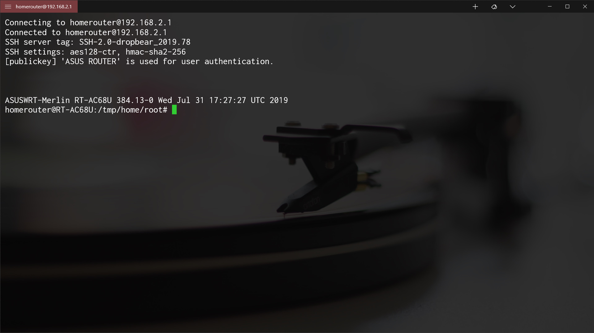
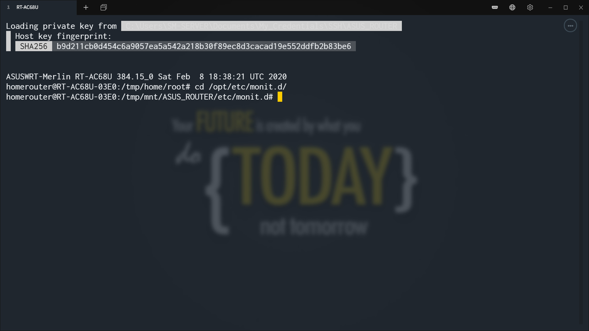
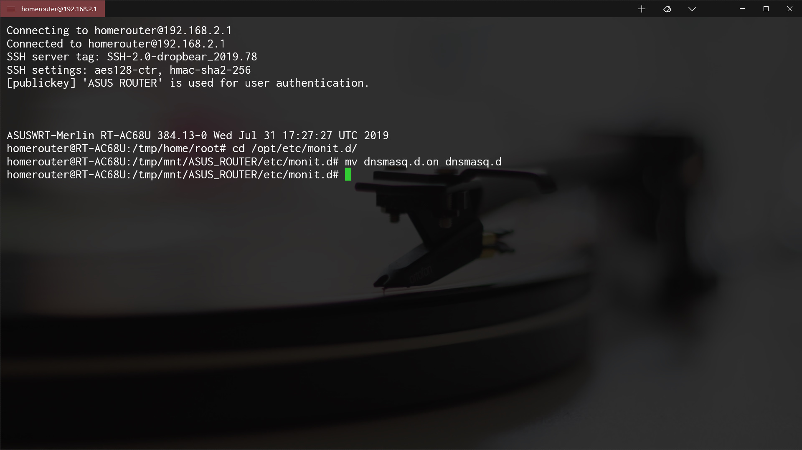
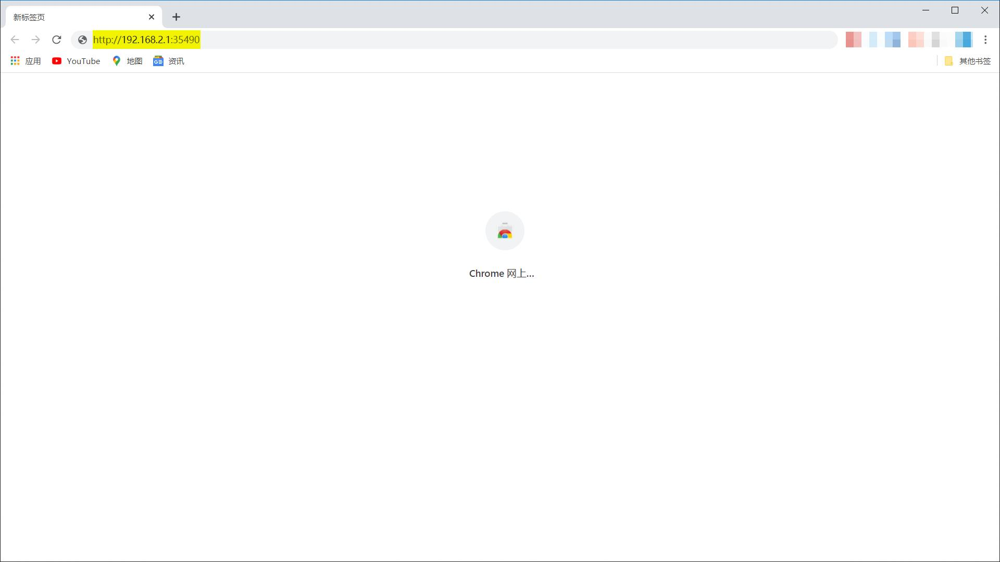
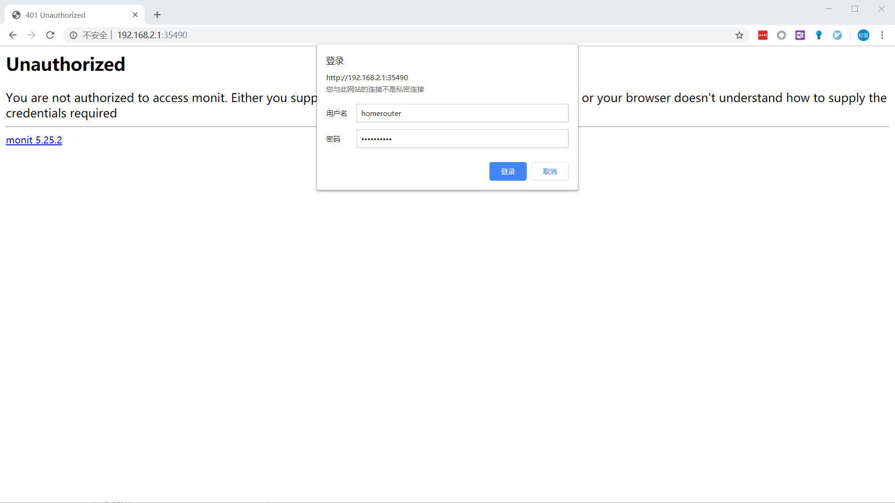
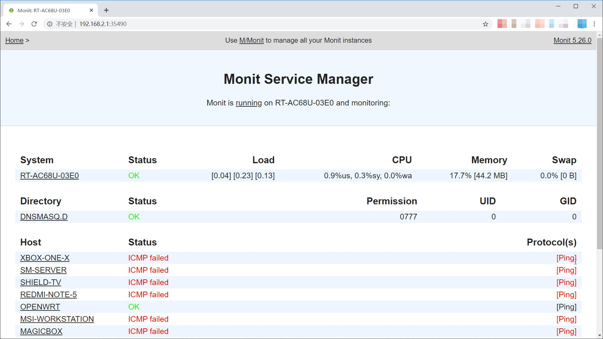
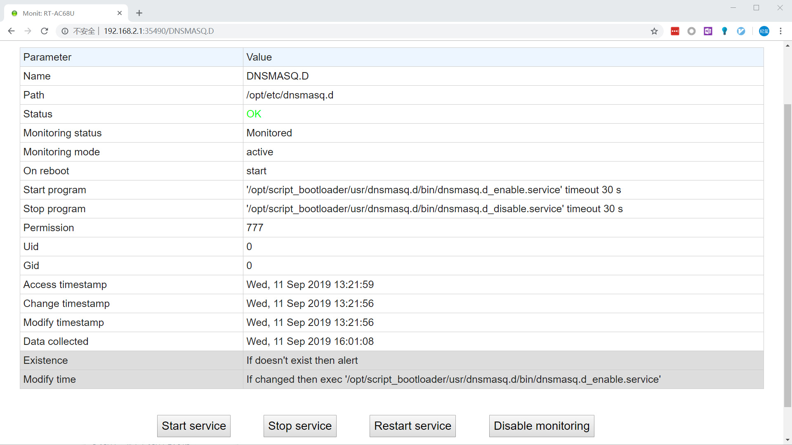

# Readme for monit

## 概述

1. 本插件用于安装、配置Monit进程管理系统

## 安装前提

1. 必须安装并启用entware

## 文件结构

`/opt/script_bootloader/usr/monit/`

| 权限      | 名称      | 属性     | 说明           |
| --------- | --------- | -------- | -------------- |
| rwxrwxrwx | README.md | 普通文件 | 说明文件       |
| rwxrwxrwx | bin       | 目录     | 可执行文件目录 |

`/opt/script_bootloader/usr/monit/bin/`

| 权限      | 名称          | 属性     | 说明           |
| --------- | ------------- | -------- | -------------- |
| rwxrwxrwx | monit_install | 普通文件 | 插件的安装程序 |

## 安装方法

执行`/opt/script_bootloader/usr/monit/bin/monit_install`

   > [受支持的路由器型号](https://github.com/Entware/Entware/wiki/Install-on-Asus-stock-firmware)：
   >
   > | 架构        | 路由器型号                                                                         |
   > | ----------- | ---------------------------------------------------------------------------------- |
   > | **aarch64** | RT-AC86U                                                                           |
   > | **armv7**   | RT-AC68U, RT-AC56U, RT-AC87U, RT-AC3200, RT-AC88U, RT-AC3100, RT-AC5300, GT-AC5300 |
   > | **mipsel**  | RT-N66U, RT-AC66U, RT-N16                                                          |

## 调用方法

由entware自动执行

## 使用方法

#### 启用/禁用插件

1. 用ssh登陆路由器后台

   

2. 执行下列代码，进入monit配置文件目录

   ```shell
   cd /opt/etc/monit.d/
   ```

   

3. 启用/禁用特定插件

   - 启用插件：`mv 目标插件 目标插件.on`

     

   - 禁用插件：`mv 目标插件.on 目标插件`

     

4. 执行`monit reload`，应用修改

   > 被启用的插件将可见于Monit进程管理器管理页面
   >
   > 被禁用的插件将消失于Monit进程管理器管理页面

   

#### 使用Web管理页面

1. 在浏览器地址栏输入`http://路由器地址:35490`

   

2. 在弹出的对话框中输入用户名和密码

   > 用户名：路由器管理页面登陆用户名
   >
   > 密码：路由器管理页面登陆密码

   

3. 单击“登录”，进入Monit进程管理器管理页面

   > 此处显示各插件的概要信息：运行状态，运行时间，CPU占用，内存占用等

   

4. 单击插件名（例如dnsmasq.d），可进一步查看该插件的详细信息并进行管理（包括启动监控、启动、停止、重启和停止监控）

   